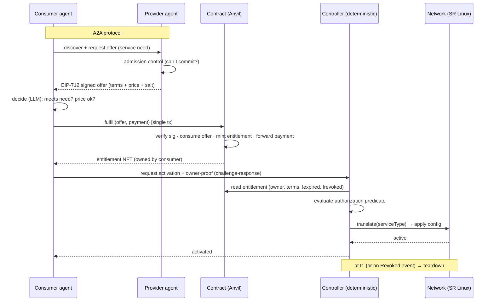
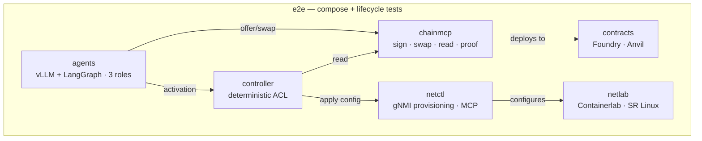

# Agent-to-Agent Tokenized Network-Service Provisioning

### Project Design & Execution Plan

> **Status: the original formal plan (historical).** This captures the design as conceived
> up front and is preserved as the record of intent. Where the build diverged, the *current*
> truth lives elsewhere — read those first for anything operational:
> - **Telemetry** is now the *right to configure export on the device* (a gNMI dial-out
>   config), not a provider-side forwarder — see `docs/adr/007-telemetry-delivery.md`
>   (revision) and `docs/03-interfaces.md` §5.1.
> - **The LLM** runs on a deployed Modal vLLM endpoint (`llmserve/`), not just local serve —
>   `docs/adr/001-llm-serving.md` (amendment).
> - **The demo surface** is the interactive operator console (`just console`), with the
>   Streamlit view kept as a headless tail — `docs/08-demo-dashboard.md`.
> - **Feasibility numbers** live in `docs/09-evaluation.md`; the milestone map + status in
>   `docs/01-implementation-plan.md`. The ADRs (`docs/adr/`) are the authoritative decisions.

**Stack:** LangGraph · MCP · A2A protocol · vLLM-on-Modal · Foundry/Anvil · Containerlab + Nokia SR Linux · pygnmi/gNMI

## 1. Overview, thesis statement, scope

### 1.1 What this is

Autonomous AI agents (LLMs) procuring **network services** from one another, settling the transaction through a **smart contract**. A consumer agent needs a network service; a provider agent supplies it. Payment and a service **entitlement** are exchanged in a single atomic on-chain settlement, and the provider then activates the service on a real network.

We demonstrate the pattern with **one consumer** and **two independent providers**, each selling a different *kind* of network service:

- **Bandwidth-on-demand** — a guaranteed-rate path between two endpoints for a time window.
- **Telemetry configuration** — configuring a router to stream specified telemetry to a collector the consumer designates, for a time window.

The two services are **not** part of one composite scenario. They are two independent demonstrations that the *same settlement pattern* works across different service types. The consumer "needs a network service, for its own purposes" — once that service is bandwidth, once it is telemetry config.

### 1.2 Thesis statement

> A service-agnostic, trust-minimized settlement pattern for autonomous agent-to-agent network-service provisioning, in which payment is atomically exchanged for a **tokenized entitlement** (a bearer capability) via a standardizing smart contract, and the entitlement is honored by the provider's enforcement plane. The settlement layer is uniform across services; the entitlement's terms and the activation mechanics specialize per service. Demonstrated end-to-end on bandwidth-on-demand and telemetry-configuration.

### 1.3 Why a smart contract at all

The contract is used for its **properties**, not because it solves trust:

- **Assured exchange** — payment and entitlement change hands atomically, or not at all.
- **Standardization** — every service procurement, regardless of service type, uses one transaction interface. This is the strongest expression of the contribution: *the contract standardizes the transaction.*
- **Auditability** — the full settlement history is on-chain and verifiable.

The contract does **not** establish trust that the service will be delivered. That trust is *assumed* (see §2.4).

### 1.4 Scope and non-goals

**In scope:** the settlement pattern; the entitlement model; two service instantiations; the autonomous agent loop (discovery → decision → settlement → authorization → activation → teardown); an end-to-end working prototype.

**Out of scope (deliberately):**

- **Delivery verification / oracles** — we do not verify that the provider actually delivered the contracted SLA.
- **Non-delivery handling, disputes, refunds** — not modeled. (Refund-capable streaming escrow is noted as a future extension only.)
- **Negotiation** — prices are fixed by the provider; the consumer requests them and decides yes/no.
- **Overselling** — guaranteed allocation means admission control and reservation, the deliberate inverse of best-effort overselling.
- **Cross-chain / HTLC** — single-chain, single-contract; atomicity is free (see §2.1).
- **Secondary markets** — entitlement transferability is supported by the NFT primitive and noted as optional, but resale is not a demonstrated feature.

---

## 2. Conceptual model

### 2.1 Atomic settlement (not an HTLC)

Payment and the entitlement live on the **same chain**, and the swap is **one function call in one contract**. The EVM gives all-or-nothing for free: either the `fulfill` transaction completes (payment → provider, entitlement → consumer) or it reverts entirely. There are no hashlocks, timelocks, or multi-step choreography, and none of the HTLC free-option/griefing surface.

> We call this **atomic settlement**, not "atomic swap," to avoid implying HTLC mechanics to crypto-literate readers.

**Atomicity boundary.** The atomicity covers **payment ↔ entitlement** only. Service *delivery* sits outside it by design — that is the assumed-trust gap (§2.4). We do not attempt to make payment-and-service atomic.

### 2.2 The entitlement is a capability, not the resource

The token **never represents the bandwidth (or the telemetry stream) itself.** Network bandwidth is continuous, fungible, and routinely oversold; a telemetry stream is likewise not a discrete object. What the consumer holds is a **right** with specific terms — "up to X Mbps on path A→B from t0 to t1 at QoS class Q." That bundle of terms is discrete, unique, and ownable, even though the underlying bits are not.

This dissolves the overselling concern: overselling is the provider's internal risk management *behind* the entitlements; the entitlement is the consumer's right *in front of* them. Analogues: a concert ticket, a spectrum license, an airline seat, a futures contract on a fungible commodity.

Because each procurement carries a bespoke terms bundle, **ERC-721 (NFT)** is the natural primitive — uniqueness comes from the terms, not from the resource being a physical object.

### 2.3 The entitlement is load-bearing (a capability, not a receipt)

The entitlement is a **bearer capability** that the provider's enforcement plane checks before permitting use — not a mere receipt of a payment that already happened. For an autonomy thesis this is the decisive choice:

- If the entitlement is a **capability**, the provider authorizes the consumer by **checking on-chain ownership**. No human, no account setup, no out-of-band API-key handshake — the right travels with the token, and two agents that have never met can transact with self-contained, cryptographically verifiable authorization.
- If it were a **receipt**, *something else* did the authorizing, and that channel would itself need to be autonomous and trust-minimized — at which point you would fold it back into the token anyway.

The terms in the entitlement therefore serve two functions (and, given delivery verification is out of scope, **only** these two): (1) the **authorization scope** the enforcement plane is permitted to program, and (2) an **audit record** of what was agreed.

### 2.4 Trust model


| Property                                                    | Status                                         |
| ------------------------------------------------------------- | ------------------------------------------------ |
| Consumer can't pay twice; entitlement can't be double-owned | Trustless (base layer)                         |
| Payment ↔ entitlement exchanged atomically                 | Trustless (single-tx EVM)                      |
| A signed offer can't be fulfilled twice                     | Trustless (consumed-offer set)                 |
| Requester owns a valid, unexpired, unrevoked entitlement    | Trustless (challenge-response + on-chain read) |
| Provider**honors** the entitlement (delivers the service)   | **Assumed**                                    |
| The contracted SLA is actually met                          | **Assumed** (not verified — out of scope)     |

The capability model cleanly separates the trustless part (ownership/authorization) from the assumed part (fulfillment). The assumed part is exactly where a future oracle would attach — verifying delivery, not ownership.

### 2.5 The two-axis framework

The settlement pattern is uniform; what varies per service is two things.

**Axis 1 — when provisioning happens relative to the swap:** *immediate* (provisioned the instant the swap completes), *on-demand* (the swap grants a right the consumer redeems later), or *continuous* (provisioned for the entitlement's validity window).

**Axis 2 — whether the entitlement is load-bearing at the enforcement point:** *capability* (checked before use) vs *receipt* (not checked).

The design adds the most value, and the most autonomy, in the **capability** cells, and degenerates to thin escrow-plus-receipt when activation coincides with payment and consumption needs no per-use authorization.


| Service                 | Axis 1 (timing)         | Axis 2 (role) |
| ------------------------- | ------------------------- | --------------- |
| Bandwidth-on-demand     | on-demand               | capability    |
| Telemetry configuration | on-demand → continuous | capability    |

---

## 3. Actors and roles


| Actor                        | Kind                   | Responsibility                                                                                                                                                                      |
| ------------------------------ | ------------------------ | ------------------------------------------------------------------------------------------------------------------------------------------------------------------------------------- |
| **Consumer agent**           | LLM (vLLM + LangGraph) | Needs a network service. Discovers providers, requests offers,**decides** whether to accept, submits the settlement, requests activation. Runs the full lifecycle once per service. |
| **Bandwidth provider agent** | LLM (vLLM + LangGraph) | Publishes signed bandwidth offers. On a valid entitlement, its (deterministic) enforcement plane programs a guaranteed path on the network.                                         |
| **Telemetry provider agent** | LLM (vLLM + LangGraph) | Publishes signed telemetry-config offers. On a valid entitlement, its enforcement plane configures the requested telemetry subscription.                                            |

### 3.1 LLM judgment vs deterministic plumbing

A hard line, because it is load-bearing for correctness:

- **LLM (probabilistic) decides:** the consumer's "does this offer meet my need / is the price acceptable?"; the provider's selection of which catalog offer to quote. This is where agent intelligence lives.
- **Deterministic (never an LLM):** the atomic settlement, the **authorization predicate**, the entitlement→config **translation**, and all enforcement. *A model must never decide whether an authorization predicate passes.*

---

## 4. The two services, concretely

Both services share one settlement contract, distinguished by a `serviceType` discriminator. Each entitlement carries an abstract `resourceId` (an opaque handle the provider's controller maps to concrete topology) plus a typed parameter blob whose schema depends on `serviceType`.

### 4.1 Bandwidth-on-demand

- **What is sold:** the right to up to *X* Mbps on path A→B, for window `[t0, t1]`, at QoS class *Q*. Guaranteed allocation (the provider runs admission control before signing an offer — it does not oversell). *Canonically:* Bell signs 50 Mbps on path A→B, 14:00–16:00, for 10 TOK; `fulfill` mints ticket #7 to Ada.
- **Entitlement params:** `capacityBps`, `qosClass`, `pathResourceId`.
- **Activation:** the consumer redeems the entitlement; the controller resolves `resourceId` → ports/links and programs a meter/shaper at `capacityBps` and the queue/DSCP for `qosClass` on SR Linux. Teardown at `t1`.

### 4.2 Telemetry configuration (independent)

- **What is sold:** configuring a router to stream specified telemetry (gNMI subscriptions — e.g. interface/queue counters on a node) to a **collector endpoint the consumer designates**, for window `[t0, t1]`.
- **Entitlement params:** `sensorPaths` (which telemetry), `collectorEndpoint`, `sampleInterval`.
- **Activation:** the consumer redeems the entitlement; the controller installs the gNMI subscription on SR Linux pointing at the collector. Teardown (subscription removal) at `t1`.

### 4.3 What this proves

Two genuinely different network services — one shapes the data plane, one configures the management/telemetry plane — flowing through **identical** settlement and authorization machinery. Only the **translator** (entitlement terms → device config) differs. This is the `serviceType` discriminator made concrete and is the heart of the "service-agnostic pattern" claim.

---

## 5. End-to-end transactional lifecycle

The canonical happy path. The consumer runs this once per service; only the activation/translation step differs by `serviceType`.



**Phases:** discover → offer (signed) → decide → settle (pay + mint) → authorize (owner-proof + predicate) → activate (translate → config) → operate → teardown (expiry or revocation).

---

## 6. Architecture

### 6.1 Bounded contexts and dependency map

Three lenses, each with one job: **DDD bounded contexts** decide *what the modules are* (durable seams); the **transactional lifecycle** decides *integration order and behavior* (the vertical thread); **component/deployment** decides *how each piece runs and is debugged in isolation*.



Read each arrow as both a runtime call path **and** a build dependency — and as a **mock seam**: the far end of each arrow is where a mock lives so the near end can be built in isolation.

### 6.2 Ports & Adapters (every module)

Each module keeps **domain logic in a pure, fast-testable core** with **adapters at the edges** talking to the outside world (chain, network, LLM, MCP). A mock is simply another adapter behind the same port. This is not a convenience — it is the architecture (Farley, *Modern Software Engineering*, Ch. 11) that makes mock-first integration sound and makes the domain unit-testable.

The single most important application: the **controller's domain** (authorization predicate + lifecycle state machine) must know nothing about Ethereum or SR Linux. It talks to ports — "read entitlement," "apply config" — implemented by adapters.

### 6.3 Tech-stack mapping


| Concern              | Technology                                                |
| ---------------------- | ----------------------------------------------------------- |
| Agent reasoning      | vLLM (local serve, small model e.g. Qwen3-4B) + LangGraph |
| Agent-to-agent comms | A2A protocol (discovery, offer, accept)                   |
| Tool access          | MCP servers (`chainmcp`, network provisioning MCP)       |
| Settlement           | Solidity + Foundry; Anvil local chain                     |
| Payment              | Mock ERC-20 test token                                    |
| Network substrate    | Containerlab + Nokia SR Linux                             |
| Programmatic config  | gNMI via pygnmi (Set/Get/Subscribe)                       |

> **Why gNMI over Ansible:** SR Linux is model-driven and gNMI-native; gNMI gives Set/Get/Subscribe directly (clean for an agent-triggered tool), and telemetry is *also* gNMI Subscribe — so one protocol covers both services and unifies the provisioning layer.

---

## 7. Settlement contract design

### 7.1 Offers and minting

- **EIP-712 signed offers.** The provider publishes signed offers (terms + price + unique salt + validity). The provider's signing policy *is* its admission control — for guaranteed allocation it signs only as many as it can honor.
- **Single-use.** The contract records each consumed offer hash; a signed offer cannot be fulfilled twice.
- **Mint-at-swap (not pre-mint).** The entitlement is created only when paid for, with terms bound to the actual purchase (window relative to purchase time or chosen within the offer). Reservation is coupled to sale; minting *is* the act of committing the resource. (Prior art for the order/offer model: OpenSea's Seaport.)
- The provider need not be online per-swap — the signature *is* its authorization to mint those terms at that price.

### 7.2 On-chain authorization terms vs descriptive metadata

The authorization-relevant fields must be in **contract storage** (immutable, queryable in the same trust domain as ownership) — never only in off-chain `tokenURI` JSON, which can 404 or mutate. The rich SLA document (latency/jitter/loss targets) is committed only as a `termsHash`, since we don't verify or enforce it (out of scope) — it needs to be tamper-evidently committed, not efficiently readable. `tokenURI` is best **generated on-chain** as a `data:` URI from the same struct (no IPFS, no pinning).

```solidity
struct Entitlement {
    address issuer;       // provider; the controller honors only its own issuer
    uint8   serviceType;  // 0 = bandwidth, 1 = telemetry  (dispatch key)
    bytes32 resourceId;   // abstract handle → controller maps to ports/links
    bytes   params;       // ABI-encoded, per-serviceType (capacity/qos | sensors/collector)
    uint64  startTime;    // [t0, t1] activation window
    uint64  endTime;
    bool    revoked;      // issuer kill-switch
    bytes32 termsHash;    // commitment to the full off-chain SLA doc (audit)
}
mapping(uint256 => Entitlement) public entitlements;
```

### 7.3 Revocation and expiry

- **Expiry** is *passive and predetermined*: the window is in the terms and checked at read time against `block.timestamp`. No transaction expires it; an expired entitlement is simply one the controller won't honor.
- **Revocation** is *active and discretionary*: a **flag** set by an issuer-only `revoke()` (not a burn — a flag preserves the audit trail of who revoked and when, mirroring credential-revocation registries).

> An issuer-revocable entitlement is **not a sovereign bearer asset — it is a revocable credential**, a claim against the provider the provider can cancel under defined conditions. Appropriate for a service entitlement, but state it plainly.

### 7.4 The authorization predicate

The controller's complete gate — write this out in the thesis, it *is* the capability model in one expression:

```
authorized(requester, id, action) :=
    ownerOf(id) == requester        // proven via fresh challenge-response
 && !expired(id)                    // block.timestamp within [t0, t1]
 && !revoked(id)                    // issuer hasn't pulled it
 && action ⊆ terms(id)              // requested ≤ granted
 && no_conflicting_active_session   // controller-local metering
```

### 7.5 Events

`EntitlementMinted(id, issuer, serviceType, consumer)`, `OfferConsumed(offerHash)`, `Revoked(id)`. The controller subscribes to `Revoked` for proactive teardown.

---

## 8. Controller / anti-corruption layer (ACL)

The controller is the one place the **settlement model and the network model meet and are translated**. It is **deterministic, never an LLM**. A shared domain core is reused by both providers; each provider configures it with its `serviceType`, its translator, and the shared network adapter, and honors only entitlements where `issuer == itself`.

**Internal structure (ports & adapters):**

- **Domain core (pure):** the authorization predicate (§7.4) and the lifecycle state machine (pending → active → torn-down). Fast unit tests, no I/O.
- **Translators (per `serviceType`):** entitlement terms → data-plane config. Bandwidth → QoS meter/shaper + queue/DSCP. Telemetry → gNMI subscription to the collector.
- **Adapters (behind ports):**
  - *chain-reader* — `ownerOf`, `entitlements(id)`, revocation, via view-calls.
  - *network-applier* — calls `netctl` to apply/teardown.
  - *auth* — challenge-response.

**Off-chain authorization (SIWE / EIP-4361 style):** the controller issues a fresh nonce; the consumer signs `(nonce, token_id, controller_id, expiry)`; the controller verifies the signature recovers to the **current** owner and the nonce is fresh. This is the replay-safe binding between off-chain network enforcement and on-chain ownership.

**Reads = pull, revocation = push:** view-calls on demand at activation (freshest); subscribe to `Revoked` to tear down a live session mid-window.

**Entitlement overuse** is enforced in controller-local state (meter against the token; refuse activations that would exceed the grant). **Transfer-during-session rule:** redemption binds the live session to the address that activated it; transferring a redeemed/active entitlement conveys only future/unused rights.

---

## 9. Agent layer

- **Serving:** vLLM hosts a small model locally; LangGraph orchestrates each role's reasoning as a graph.
- **Roles:** consumer, bandwidth provider, telemetry provider. The consumer graph: discover → request offer → *decide* → settle → request activation. The provider graph: receive request → admission control → *select & sign offer* → (on activation) trigger deterministic enforcement.
- **MCP tools the agents call:**
  - `chainmcp` — sign offer (provider), submit fulfill/swap (consumer), read entitlement, produce owner-proof.
  - network provisioning MCP (`netctl`) — provider-side, behind the deterministic controller.
- **A2A protocol:** discovery (agent cards / a simple registry), offer request, fixed-price quote (the signed offer), accept/decide.
- **Tool-call vs transaction:** a *tool call* is an agent invoking an MCP capability; a *transaction* is the on-chain state change (`fulfill`) that the tool call submits. The agent decides; the transaction is deterministic and atomic.

---

## 10. Repository decomposition / work packages

monorepo with strictly-bounded packages — same logical boundaries.


| Repo         | Context                    | Contains                                                                                                                     | Depends on                         | Mock strategy                | Done when                                                               |
| -------------- | ---------------------------- | ------------------------------------------------------------------------------------------------------------------------------ | ------------------------------------ | ------------------------------ | ------------------------------------------------------------------------- |
| `netlab`     | Network substrate          | Containerlab topology + SR Linux; manual recipes for bandwidth QoS and telemetry subscriptions; spin-up/inspect docs         | —                                 | n/a                          | Topology spins up; both recipes work by hand; documented                |
| `contracts`  | Settlement                 | Offer verify → mint-at-swap → entitlement store → revoke → on-chain tokenURI; Foundry tests; deploy script; exported ABI | —                                 | n/a (Anvil)                  | Foundry suite green incl. swap atomicity, single-use offers, revocation |
| `chainmcp`  | Settlement (agent API)     | MCP tools wrapping the contract; typed client; mock mode                                                                     | `contracts` ABI                    | mock chain                   | Tools work against Anvil; mock parity                                   |
| `netctl`     | Programmatic provisioning  | pygnmi/gNMI lib:`apply_bandwidth`, `apply_telemetry`, `teardown`; MCP server; mock mode                                      | `netlab`                           | mock lab                     | Real config applied to lab; mock parity                                 |
| `controller` | Provisioning control (ACL) | Pure domain (predicate + lifecycle) + translators + adapters + auth + watchers                                               | `contracts`, `netctl` (via ports)  | built against mocks of both  | Predicate + lifecycle unit-tested; wired to real adapters               |
| `agents`     | Autonomy                   | vLLM serving; LangGraph graphs (3 roles); MCP clients; A2A                                                                   | `chainmcp`, `controller`/`netctl` | mock tools                   | Each role runs against mock tools, then real                            |
| `e2e`        | Orchestration              | Compose (Anvil + contracts + netlab + controller + vLLM + agents); lifecycle integration tests; Streamlit dashboard          | all                                | progressive mock replacement | Full lifecycle green for both services                                  |
| `interfaces` | Context map                | The cross-context schemas/ports (published language)                                                                         | —                                 | —                           | Sketched before adapters; versioned                                     |

> `netctl` is **shared** by both providers (it exposes both `apply_bandwidth` and `apply_telemetry` against the same lab). The controller has **two translators but one network adapter**.

---

## 11. Execution methodology

Grounded in Farley's *Modern Software Engineering* (optimize for **learning** + **managing complexity**) and the walking-skeleton / outside-in TDD method of Freeman & Pryce's *Growing Object-Oriented Software Guided by Tests*.

### 11.1 The one rule

**You never "merge at the end."** "Build each part fully, then integrate" is big-bang integration — the anti-pattern. Keep **one working, integrated system at all times** and grow it. Integration is continuous, not a phase. The decomposition gives modularity; modularity must be paired with continuous integration or it becomes the big-bang trap. Fast feedback is not overhead — it is what makes you fast; an integration bug found today costs minutes, found in September it costs the defense.

### 11.2 How to work

1. **Iteration 0 — walking skeleton.** The thinnest end-to-end slice through *every* context (discover → offer → swap → authorize → activate → teardown) with everything mocked, running in CI on day one. It does almost nothing real but proves the architecture holds together.
2. **Then grow in thin vertical slices.** Pick one lifecycle phase, make it real end-to-end — swap its mock for the real adapter, grow the domain behind it — and keep the whole skeleton green. Real swap (contracts + chainmcp) → real authorize/activate (controller) → real network config (netctl + netlab) → real agent decisions (agents).
3. **TDD inside each module** — the test first drives cohesion and forces you to name the module's job before over-building. Foundry tests for the contract; unit tests for the predicate, lifecycle, translators.
4. **CI from the first commit** — every push runs fast per-module unit tests + the walking-skeleton integration test. The moment something stops integrating, you hear it that day.
5. **Empirical checkpoints** — run against real Anvil and the real SR Linux lab early. A mock proves your *interface*; only the real adapter proves your *integration with reality*. Replace mocks the instant each is ready.

### 11.3 Build order

`interfaces` (sketch thin) → `netlab` + `contracts` (parallel, no deps) → `netctl` + `chainmcp` (parallel) → `controller` (vs mocks) → `agents` (vs mock tools) → `e2e` (progressive mock replacement).

> Interfaces are **sketched thin, not frozen** — enough to decouple and run a skeleton, then evolved by feedback. Designing them perfectly upfront is "the lure of the plan."

### 11.4 Proportionality (solo, on a clock)

Keep the technical core (ports & adapters, TDD, CI, walking skeleton, thin slices, small commits); drop team/org ceremony (a self-reviewed diff before merging to main is plenty). Mind "fear of over-engineering": thin interfaces, not elaborate ones. "DRY is too simplistic": prefer duplicating a small struct over coupling two bounded contexts — share the published language (the interface), not implementation.

---

## 12. Interfaces / context map (sketch first)

The published language to define before the adapters (and to version):

- **Entitlement read interface** — what the controller reads from settlement (owner, terms, status).
- **Provisioning interface** — `apply_bandwidth`, `apply_telemetry`, `teardown` (the port `netctl` implements).
- **MCP tool schemas** — the tool signatures agents call (`chainmcp`, `netctl`).
- **A2A message schema** — discovery, offer (signed), accept.

These are small, stable, and the project's backbone. They surface only as much of the deferred contract-field detail as each seam actually needs.

---

## 13. Testing strategy


| Level                     | What                                                            | Proves                                                                    |
| --------------------------- | ----------------------------------------------------------------- | --------------------------------------------------------------------------- |
| **Unit**                  | Controller domain (predicate, lifecycle, translators), pure     | Logic correctness, fast feedback, good modularity                         |
| **Contract**              | Foundry tests on settlement                                     | Swap atomicity, single-use offers, mint-at-swap, revocation, expiry reads |
| **Adapter / integration** | `netctl` vs real lab; `chainmcp` vs Anvil; controller adapters | Integration with reality (not just mocks)                                 |
| **End-to-end**            | Walking skeleton → full lifecycle per service                  | The whole loop holds together; both`serviceType`s                         |

Tests are experiments: hypothesis, run, measure. The mock seams let you control variables — swap one real component in; if it breaks, you know where.

---

## 14. Risks, assumptions, decision points

### 14.1 Assumptions (stated, flippable)

Trust the provider to deliver · fixed prices · guaranteed allocation with admission control (no overselling) · one shared contract with `serviceType` discriminator · mock ERC-20 payment · single-chain settlement · capability (load-bearing) entitlements.

### 14.2 Open decision points (flip-points)


| Decision                    | Current default                                  | Alternative                                 |
| ----------------------------- | -------------------------------------------------- | --------------------------------------------- |
| `tokenURI`                  | on-chain generated`data:` URI                    | IPFS                                        |
| Entitlement transferability | transferable (resale possible)                   | soulbound                                   |
| Settlement timing           | instant (provider paid at swap; refunds trusted) | streaming escrow (trustless partial refund) |
| Controller deployment       | shared core, per-provider instance               | single multi-serviceType service            |

### 14.3 Risks

- Small-model reliability for agent decisions (mitigate: keep LLM scope to clear yes/no decisions; deterministic everywhere else).
- SR Linux / gNMI learning curve (mitigate: `netlab` first, by hand, before automation).
- Integration complexity (mitigate: walking skeleton + CI from day one).
- Timeline (mitigate: implement bandwidth fully; reuse ~80% for telemetry; map non-built variation conceptually).

---

## 15. Glossary (ubiquitous language)

- **Entitlement** — the tokenized right (NFT) the consumer holds; a bearer capability with terms. *Never* the physical resource.
- **Capability** — an entitlement the enforcement plane checks before permitting use (load-bearing).
- **Offer** — a provider's signed, fixed-price, single-use proposal to mint an entitlement on given terms.
- **Atomic settlement** — the single-transaction exchange of payment for entitlement (not an HTLC).
- **serviceType** — the discriminator (bandwidth | telemetry) the controller dispatches on.
- **resourceId** — an abstract on-chain handle the controller maps to concrete topology.
- **Controller / ACL** — the deterministic anti-corruption layer translating entitlement terms into network config.
- **Enforcement point** — where the entitlement is checked and the service is permitted/programmed (here, the SDN/SR Linux control path).
- **Activation / teardown** — turning the service on (redeeming the capability) / off (expiry or revocation).
- **Port / adapter** — a domain-facing interface / its concrete implementation (chain, network, mock).
- **Walking skeleton** — the thinnest end-to-end slice through all components, integrated first.

---

## 16. Indicative timeline (→ mid-September 2026)

Roughly three working months; indicative, not a contract.


| Phase  | Focus                                                                               | Output                                                                                                                               |
| -------- | ------------------------------------------------------------------------------------- | -------------------------------------------------------------------------------------------------------------------------------------- |
| **P1** | `netlab` + `contracts` foundations; `interfaces` sketch; **walking skeleton** in CI | Lab spins up; Foundry suite green; mocked end-to-end runs                                                                            |
| **P2** | Bandwidth service real end-to-end                                                   | `netctl.apply_bandwidth`, `chainmcp`, `controller` (bandwidth translator) wired; bandwidth lifecycle green against real Anvil + lab |
| **P3** | Telemetry service real end-to-end                                                   | `apply_telemetry` + telemetry translator; second `serviceType` green (reuses settlement/controller core)                             |
| **P4** | Agent autonomy + A2A                                                                | LangGraph graphs, MCP clients, A2A discovery/offer/accept; agents drive the loop against real components                             |
| **P5** | e2e demo + dashboard + thesis integration                                           | Streamlit dashboard; full demo for both services; results folded into the paper/defense                                              |

---

*This document is meant to be revised. As implementation teaches you the contract's exact fields and SR Linux's precise QoS/telemetry paths, those firm up **within their owning repo** without touching the interfaces — defer every decision you haven't made yet to the context that owns it.*
