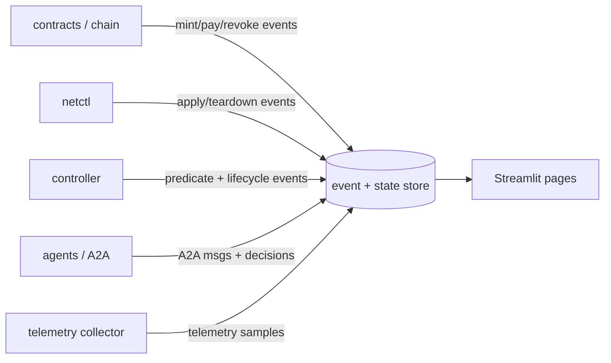
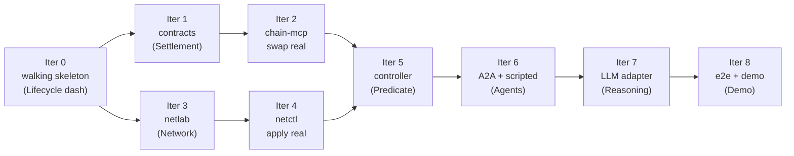

## A. Reevaluation — is the decomposition good enough?

### Verdict: **GO**, with seven refinements folded in.

The seams are right (bounded contexts by domain), the lifecycle is correct, and ports & adapters makes the whole thing testable and integrable. Nothing here requires re-architecting. The refinements below mostly *de-risk* and *prioritize*; each notes which `DESIGN.md` section it amends.

### A.1 What's already right (don't change)

The settlement-as-standard-interface claim, the entitlement-as-capability model, the trust boundary, the two-axis framework, the deterministic-controller-vs-LLM split, and the mock-first/walking-skeleton method. Keep all of it.

### A.2 Refinement 1 — the agent's decision is a **port**, not a hard dependency on the LLM ⭐ (amends §3.1, §9)

This is the most important change. Right now the agents' reasoning is welded to vLLM + LangGraph, which means your entire demonstrable system is hostage to a 3B model behaving consistently on demo day. Don't accept that risk.

Make the decision a port:

```
DecisionPolicy:
    decide_consumer(need, [offers]) -> chosen_offer | reject
    select_offer_to_quote(catalog, request) -> offer
```

with **two interchangeable adapters**:

- **ScriptedPolicy** — deterministic rules ("accept cheapest offer meeting the need; reject if price > budget or capacity < need"). Used by the walking skeleton and by *almost all* testing.
- **LLMPolicy** — vLLM (Llama 3.2 3B) + LangGraph behind the same interface.

Consequence: the entire system runs, integrates, and is demonstrable end-to-end **without the LLM**, and the LLM becomes a swappable final layer (Iteration 7). If the model misbehaves during the defense, you flip one config flag back to scripted and the system still works. The LLM is now an *enhancement you can show*, not a *dependency that can sink you*. This is ports & adapters applied to the riskiest part of the project.

### A.3 Refinement 2 — recommend **monorepo with packages** (amends §10)

Last time I hedged. For a solo build on a September clock, the hedge isn't helpful — commit. Use **one monorepo with strictly-bounded packages** (`/contracts`, `/netctl`, `/controller`, `/agents`, `/dashboards`, `/interfaces`, `/e2e`), each built and tested in isolation with its own CI job. You get the modularity and forced-clean-boundaries you wanted (the bounded contexts are identical) without the cross-repo version dance, the git-submodule choreography, or the `interfaces` coupling-hub problem. Polyrepo stays a valid option, but monorepo is the right default here. The logical decomposition does not change either way — that's the whole point of choosing seams by domain.

### A.4 Refinement 3 — add the **telemetry collector** as a real component (gap; amends §4.2, §10)

The telemetry service streams gNMI samples *somewhere*, and "somewhere" was missing from the decomposition. You need a collector: a small gNMI subscriber (gNMIc, or a pygnmi `Subscribe` loop) that receives the stream and writes it to the event/state store (§B.2). It's also what makes the telemetry service *visible* on the Network dashboard. Add it as a package (`/collector`) — small, but it's load-bearing for both the demo and the telemetry proof.

### A.5 Refinement 4 — make agent **identity/keys** and the consumer **need-spec** explicit (amends §9)

Two small things that are implied but unspecified:

- **Identity & keys.** Each agent *is* an Ethereum account on Anvil (Anvil seeds funded accounts). The consumer's address owns entitlements; each provider's address is its `issuer`. The controller's per-issuer trust anchor is literally "honor entitlements where `issuer == my provider's address`." State this — it's the whole identity model and it's free.
- **Consumer need-spec.** The consumer's "need" must be a concrete object so a policy (scripted *or* LLM) can decide against it, e.g. `{serviceType, minCapacityBps | sensorPaths, window, maxPrice}`. This is the input to `decide_consumer`.

### A.6 Refinement 5 — the controller is a **library/package**, not a network service (amends §8, §10)

It reads on simplicity to make the controller a standalone service. It doesn't need to be one. The controller is deterministic logic each provider invokes; ship it as a **package both provider agents import** (configured with their `serviceType`, translator, and the shared `netctl` adapter). Fewer moving parts, same bounded-context separation (deterministic core stays out of the LLM layer because it's a distinct package with its own tests).

### A.7 Refinement 6 — separate **core happy-path** from **model-completeness** features (prioritization)

Not everything in `DESIGN.md` is required for a working, defensible demo. Split it so you protect the timeline:

| Core happy-path (must work) | Model-completeness (strengthens the thesis; do if time) |
|---|---|
| Offer → fulfill (atomic mint+pay) | Revocation flag + `Revoked` watcher + mid-session teardown |
| Owner-proof + authorization predicate | Expiry teardown scheduler |
| Translate → apply (both services) | On-chain `tokenURI` generation |
| Teardown at end of window | Transfer-during-session rules / resale |

Build the left column to green for **both services** first. The right column is where you stop if September gets tight — and even unbuilt, those features are already specified in `DESIGN.md`, so the thesis can discuss them as designed-and-scoped.

### A.8 Refinement 7 — be realistic about **CI** (amends §11)

"The walking-skeleton integration test runs in CI on every push" is true only for the *mocked* skeleton. Containerlab + SR Linux (privileged, needs the image) and vLLM (needs a GPU) are too heavy for per-push hosted CI. Split it:

- **Per-push CI (hosted, fast):** unit tests (controller domain, translators), Foundry contract tests, and the **fully-mocked** end-to-end skeleton + all port contract-tests.
- **Local / nightly / self-hosted runner:** the heavy integration — real lab (`netctl` vs SR Linux) and real vLLM e2e.

This keeps the fast feedback loop genuinely fast and honest.

### A.9 The thing that ties viz and the thesis together

Every component **emits structured events to a shared store**; dashboards *and* your thesis evidence both read from it. This is ports & adapters again (the dashboard is just another reader), and it gives you the **audit trail for free** — which is one of your three core claims for using a contract at all (§1.3). Build this early; it pays triple (observability + auditability proof + paper traces).

---

## B. Visualization architecture

### B.1 Streamlit vs React — decision: **Streamlit**

Your whole stack is Python except the contracts and SR Linux config. Streamlit is Python-native, fast to build, excellent for charts and tabular state, and is exactly the right tool for a *research observability* dashboard watched by you and your advisor. React buys polish and real-time interactivity you don't need and a JS/TS toolchain you don't have time for. Decision: **one Streamlit multi-page app**, one page per concern, unified into a demo view. (Live charts — telemetry samples, interface rates — use Streamlit auto-refresh / `st.fragment` polling the store; adequate for a demo.)

### B.2 The event/state store (build in Iteration 0)

Components don't talk to the UI; they emit events to a store the UI reads.



Implementation: start with append-only **JSONL + a small SQLite** (or Redis streams if you want pub/sub later). One event schema: `{ts, source, lifecycle_id, phase, type, payload}`. The lifecycle dashboard reconstructs a run by `lifecycle_id`; the audit/paper traces are just queries over this.

### B.3 The dashboard pages

| Page | Purpose | Panels | Data source |
|---|---|---|---|
| **Lifecycle** | The spine — one run, phase by phase | Phase timeline (discover→…→teardown) with per-phase status + timestamps; current entitlement card (id, owner, serviceType, terms, state); event stream | event store (by `lifecycle_id`) |
| **Settlement** | On-chain truth | Offers table (signed/consumed); entitlements table (id, owner, serviceType, params, expiry, revoked); payment/balance panel; events + tx hashes | Anvil (live reads) + event store |
| **Network** | The service is real | Topology graph (nodes/links/ports); live per-interface rate + queue; bandwidth: iperf throughput vs the cap (shows shaping); telemetry: live sample stream chart | gNMI live + collector + event store |
| **Controller / Predicate** | The capability check, visualized | Incoming activation requests; predicate clauses each ✓/✗ (owner, expiry, revoked, action⊆terms, no-conflict); translation output; apply result; active sessions; teardown events | event store + controller |
| **Agents / Reasoning** | Autonomy | Three agents + states; A2A message log (discover/offer/accept); decision panel (need + offers in, reasoning/output, accept/reject, **active policy: scripted\|LLM**) | event store |
| **Demo** | Defense centerpiece | Composite: lifecycle spine across the top with drill-downs into the panels above; "run bandwidth" / "run telemetry" buttons; full-run replay | all of the above |

### B.4 Each iteration lights up a page

`Iter 0 → Lifecycle` · `Iter 1–2 → Settlement` · `Iter 3–4 → Network` · `Iter 5 → Controller/Predicate` · `Iter 6–7 → Agents/Reasoning` · `Iter 8 → Demo`. The dashboard grows with the system; nothing is built that you can't see.

---

## C. Detailed iteration plan

### C.0 How to read this

The build is **two parallel tracks** (Settlement, Network) that converge at the controller, then a final autonomy ladder. Each iteration is a **thin vertical slice**: it makes one or more lifecycle phases *real* end-to-end while everything else stays mocked, and the system stays green throughout. Every iteration lists **Goal · Build · Test · Dashboard · Done**.



Each lifecycle phase becomes real at a known iteration:

| Lifecycle phase | Real at |
|---|---|
| settle (pay + mint) | Iter 2 |
| authorize + activate + teardown | Iter 5 |
| discover + offer + accept | Iter 6 |
| decide (LLM) | Iter 7 |

---

### C.1 Iteration 0 — Walking skeleton

- **Goal:** the full lifecycle runs end-to-end with all-mock adapters and a `ScriptedPolicy`, proving the wiring and the sequence. Establish the event store, the orchestrator, and the Lifecycle dashboard. Stand up CI.
- **Build:** sketch the `interfaces` ports (entitlement-read, provisioning, decision, A2A msgs); mock adapters for chain, network, decision (scripted); the orchestrator that walks discover→offer→swap→authorize→activate→teardown calling ports; the JSONL/SQLite event store; the Lifecycle dashboard reading it; a hosted CI workflow.
- **Test:** one end-to-end test asserting the run reaches `activated` then `torn_down`; each phase emits its event in order; the orchestrator calls each port exactly once. (All fast, all mocked.)
- **Dashboard:** **Lifecycle** — phase timeline lights green across all phases (mocked); entitlement card shows a mock entitlement; event stream populated.
- **Done:** `make e2e` green in CI; the Lifecycle dashboard shows a complete mocked run for both `serviceType`s.

---

### C.2 Track S · Iteration 1 — Contracts (settlement, real & correct in isolation)

- **Goal:** the smart contract is real and proven by Foundry tests. No agents, no network.
- **Build:** the `Entitlement` struct; `fulfill(offer, payment)` (verify EIP-712 sig → consume offer hash → mint entitlement with bound terms → forward mock-ERC-20 payment); `revoke(id)` (issuer-only flag); expiry view; events (`EntitlementMinted`, `OfferConsumed`, `Revoked`); the mock ERC-20; deploy script to Anvil.
- **Test (Foundry):**
  - happy path: `fulfill` mints to consumer, forwards payment to provider, binds params == offer params.
  - **atomicity:** force a failing leg (insufficient allowance / mint revert) → assert *nothing* moved (balances + ownership unchanged).
  - **single-use:** second `fulfill` of the same offer reverts.
  - **signature:** wrong signer or tampered terms → reject.
  - **revoke:** issuer sets flag; non-issuer reverts.
  - **expiry:** view returns expired correctly across `block.timestamp` (`vm.warp`).
  - **fuzz** capacity/window params.
- **Dashboard:** **Settlement** — after a scripted `fulfill` against Anvil, the entitlements table shows the minted entitlement (id, owner, serviceType, params, expiry); offers table shows it consumed; payment panel shows the transfer.
- **Done:** Foundry suite green incl. atomicity + single-use + revoke + expiry; deployed to Anvil; Settlement dashboard reflects a real mint.

### C.2 Track S · Iteration 2 — chain-mcp + swap slice real

- **Goal:** replace the mock-chain adapter with the real one; the **settle** phase is real in the lifecycle.
- **Build:** `chain-mcp` tools (sign offer [provider], `fulfill` [consumer], read entitlement, produce owner-proof); typed client over the deployed contract; wire it into the orchestrator, replacing mock-swap.
- **Test:** integration vs Anvil — provider signs → consumer fulfills → entitlement owned by consumer; owner-proof recovers to the owner. **Port-contract test**: a single shared test suite run against *both* the mock and the real chain adapter (parity — they must satisfy the same interface).
- **Dashboard:** **Lifecycle** "settle" phase now shows real on-chain data (tx hash, real entitlement id); **Settlement** page is live.
- **Done:** lifecycle reaches `settled` with a real on-chain entitlement; everything downstream still mocked; mock/real parity test green.

---

### C.3 Track N · Iteration 3 — netlab (substrate, by hand)

- **Goal:** the network exists and you can deliver *both* services manually. This is also your SR Linux learning step.
- **Build:** Containerlab topology (≥2 SR Linux nodes forming a path); the bandwidth recipe (policer/shaper + queue/DSCP) as documented CLI/gNMI; the telemetry recipe (gNMI `Subscribe` to a collector); the **collector** (gNMIc or pygnmi subscriber → event store); spin-up/inspect docs.
- **Test (smoke scripts):** apply a bandwidth cap → `iperf` shows throughput shaped to ~cap (within tolerance); apply a telemetry subscription → collector receives ≥1 sample within N seconds; teardown restores baseline.
- **Dashboard:** **Network** — topology graph; live per-interface rate; iperf throughput vs cap (the shaping is *visible*); telemetry sample stream charting live from the collector.
- **Done:** both services demonstrably work by hand; Network dashboard shows live interface stats and live telemetry samples.

### C.3 Track N · Iteration 4 — netctl (programmatic, real)

- **Goal:** programmatic apply/teardown over gNMI; replace the mock-network adapter.
- **Build:** `netctl` lib — `apply_bandwidth(resourceId, bps, qos)`, `apply_telemetry(resourceId, sensors, collector, interval)`, `teardown(resourceId)` via pygnmi; the MCP server wrapper; a mock mode; wire it into the controller's network-applier port.
- **Test:** integration vs the lab — `apply_bandwidth` → iperf verifies shaping → `teardown` → baseline; `apply_telemetry` → collector receives; **idempotency** (apply twice = same device state); **port-contract test** mock vs real (parity).
- **Dashboard:** **Network** page now driven programmatically; changes you trigger via `netctl` show up live (rate caps, new telemetry streams).
- **Done:** real config applied/torn-down via `netctl`; mock/real parity green; Network dashboard reflects programmatic changes.

---

### C.4 Convergence · Iteration 5 — Controller (authorize + activate real, both services)

- **Goal:** the deterministic ACL is real; the **authorize → activate → teardown** phases are real end-to-end (real chain read + real `netctl`) for *both* services. This is the heart of the system.
- **Build:** the pure domain (authorization predicate + lifecycle FSM, no I/O); the chain-reader adapter (real); the network-applier adapter (real `netctl`); the auth adapter (SIWE-style challenge-response); the two translators (bandwidth → QoS, telemetry → gNMI sub); ship as a package both providers import. (Revocation watcher + expiry scheduler = model-completeness, see A.7 — wire if time.)
- **Test:**
  - **predicate (pure unit, exhaustive truth table):** valid → allow; owner mismatch → deny; expired → deny; revoked → deny; over-grant (action ⊄ terms) → deny; conflicting active session → deny.
  - **FSM (unit):** pending→active on valid activation; reject double-activate; active→torn_down on expiry/revoke.
  - **auth (unit):** valid challenge-response passes; replayed nonce rejected; stale rejected; signature from non-owner rejected.
  - **integration:** full authorize→activate with real chain + real `netctl` for both `serviceType`s; (if built) `Revoked` event → teardown observed; expiry → teardown observed.
- **Dashboard:** **Controller / Predicate** — each activation request shows the predicate clauses ✓/✗ (this visualizes the capability check, great for the defense), the translation output, the apply result; active sessions table. **Lifecycle** authorize+activate phases now fully real.
- **Done:** full lifecycle real **except agent decisions** (still scripted) for both services; Predicate dashboard shows the gate evaluating live.

---

### C.5 Iteration 6 — A2A + scripted-policy agents (real comms, scripted brains)

- **Goal:** inter-agent communication is real (discovery, offer, accept); decisions still use `ScriptedPolicy`. The whole loop is now real except the LLM.
- **Build:** the A2A layer (agent cards / a simple registry; offer request/response; accept); the consumer need-spec; the three agent shells wired over A2A using `ScriptedPolicy`; agent identities = Anvil accounts; providers' admission-control path.
- **Test:** A2A message-schema contract tests; integration — consumer discovers providers → requests offers → scripted-accept → real settle → real activate, for both services; provider **refuses** when admission control says no capacity.
- **Dashboard:** **Agents / A2A** — the three agents + states; the message log (discover/offer/accept) animating; **Lifecycle** now driven by real A2A comms; policy indicator shows "scripted".
- **Done:** end-to-end with real A2A + real everything-downstream, scripted decisions, both services.

---

### C.6 Iteration 7 — LLM decision adapter (vLLM + LangGraph)

- **Goal:** swap `ScriptedPolicy` for `LLMPolicy`; the agents now reason. The system is fully autonomous — and still falls back to scripted via a config flag.
- **Build:** vLLM serving Llama 3.2 3B; LangGraph graphs for the consumer's `decide_consumer` and the provider's `select_offer_to_quote`; the `LLMPolicy` adapter behind the same port; prompts.
- **Test:** **behavioral** — (need, good offer) → accept; (need, under-capacity or over-budget offer) → reject; run K times and assert ≥ a consistency threshold (acknowledge variance — it's a 3B model, this is a measured property, not a hard invariant); **A/B vs `ScriptedPolicy`** on a fixed scenario set; full e2e with LLM decisions for both services.
- **Dashboard:** **Agents / Reasoning** — the decision panel shows the need-spec + offers in, the model's reasoning/output, accept/reject, and policy = "LLM"; **Lifecycle** now fully autonomous.
- **Done:** autonomous e2e for both services with LLM-driven decisions; one config flag reverts to scripted (the de-risk from A.2 proven to work).

---

### C.7 Iteration 8 — e2e composition, completeness, demo polish

- **Goal:** one-command full system; the unified Demo dashboard; the model-completeness features; thesis artifacts captured.
- **Build:** compose (Anvil + deploy contracts + lab + collector + controller + vLLM + agents + dashboards); the unified Demo page; demo scripts for both services + (if built) a revocation scenario and an expiry scenario; capture runs (event-store traces, screenshots) for the paper.
- **Test:** full compose e2e for both services; revocation + expiry demo scenarios (if built); clean-machine smoke; verify the event store yields a complete, queryable trace per run (the audit-trail claim).
- **Dashboard:** **Demo** — composite, live, with run buttons and replay. Your defense centerpiece.
- **Done:** `make demo` runs both services end-to-end autonomously with the full dashboard; traces captured for the thesis.

---

## D. Revised timeline (iterations → phases)

| Phase | Iterations | Visible milestone (the dashboard you can demo) |
|---|---|---|
| **P1 — foundations + skeleton** | Iter 0; Track starts (Iter 1, Iter 3 in parallel) | Lifecycle dashboard runs a full mocked flow; Settlement shows a real mint; Network shows manual services live |
| **P2 — bandwidth real** | Iter 2 (swap), Iter 4 (netctl), Iter 5 for bandwidth | Bandwidth lifecycle fully real; Predicate dashboard evaluating live; shaping visible on Network |
| **P3 — telemetry real** | Iter 5 telemetry translator + `apply_telemetry` | Second `serviceType` green reusing settlement + controller core; telemetry stream live on Network |
| **P4 — autonomy** | Iter 6 (A2A + scripted), Iter 7 (LLM) | Agents dashboard: real A2A; Reasoning dashboard: LLM deciding; full autonomous loop |
| **P5 — demo + writeup** | Iter 8 | Unified Demo dashboard; both services; captured traces folded into the paper/defense |

Indicative, not a contract — slide the boundaries to fit thesis writing and interviews.

---

## E. "Ready to proceed" checklist

You're ready to start Iteration 0 when:

- [ ] Decision is modeled as the `DecisionPolicy` port with a `ScriptedPolicy` adapter (A.2).
- [ ] Repo is a monorepo with the package boundaries from A.3.
- [ ] `/collector` is in the component list (A.4).
- [ ] The consumer need-spec and agent-identity (Anvil-account = issuer/owner) model are written down (A.5).
- [ ] The event/state store schema (`{ts, source, lifecycle_id, phase, type, payload}`) is decided (A.9, B.2).
- [ ] The `interfaces` ports are sketched thin enough to run a mocked skeleton (entitlement-read, provisioning, decision, A2A).
- [ ] CI split is set up: per-push (unit + Foundry + mocked skeleton) vs nightly/local (real lab + vLLM) (A.8).

Tick those and the decomposition is not just good enough — it's de-risked. Proceed to Iteration 0.
