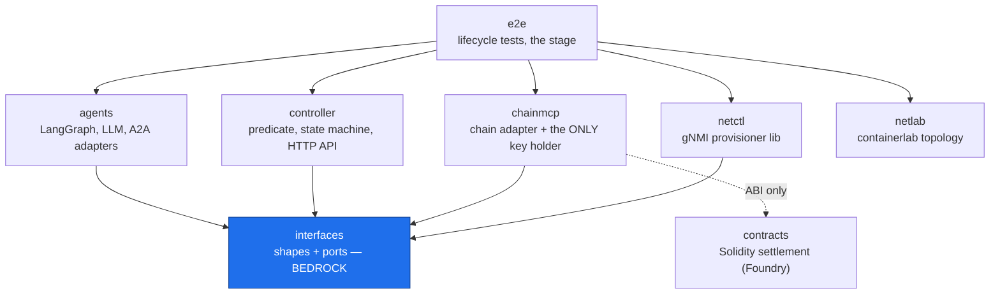
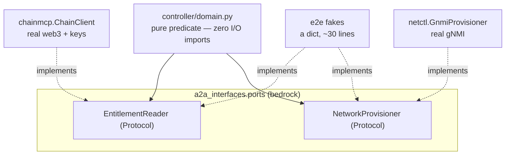
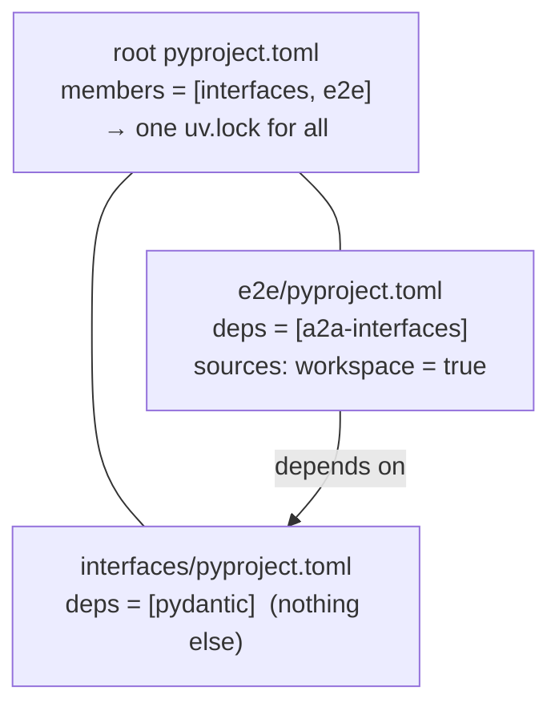

# 02 — Architecture: modules, boundaries, and why

> **Status:** living. Started early (after M0.2) to capture the package split and the
> interfaces layer while they are fresh. It will grow one section per phase as real
> organs replace fakes — diagrams are only honest when they describe running code, so
> this doc describes *what exists today*, not the finished system.
> **Companions:** `docs/00-the-story.md` (concepts) · `docs/03-interfaces.md` (the shapes) ·
> `docs/01-implementation-plan.md` (milestones) · `docs/adr/` (decisions) · `CLAUDE.md` (rules).

---

## 1. The one idea: dependency direction

The whole module split exists to enforce a single property: **dependencies flow in one
direction only — downward.** A package may know about packages below it; never about
packages above it. There are no cycles.

Think of it as water flowing downhill. `interfaces` is bedrock at the bottom: it depends
on nothing, so everything can safely stand on it. `e2e` is the peak: it depends on
everything, but nothing depends on it, so it is free to be messy.

This is what makes the system understandable, testable, and replaceable in pieces. Every
other rule in `CLAUDE.md` is a consequence of protecting this property.



| Package | Job | May depend on |
|---|---|---|
| `interfaces` | shapes + ports (pydantic models, Protocols) | — |
| `contracts` | Solidity settlement (Foundry) | — |
| `chainmcp` | chain adapter + signing + MCP server; **the only key holder** | interfaces, contracts ABI |
| `netlab` | containerlab topology + manual recipes | — |
| `llmserve` | Modal vLLM deployment for the agents' LLM (infra; not in the import graph) | — |
| `netctl` | gNMI provisioner lib (+ debug MCP) | interfaces |
| `controller` | predicate, state machine, auth, translators, HTTP API | interfaces (ports) |
| `agents` | LangGraph graphs, LLM client, MCP clients, A2A adapters | interfaces |
| `e2e` | skeleton, lifecycle tests, bring-up, dashboard | everything |

> **What exists today (post-M0.2):** only `interfaces` (real, with tests) and `e2e`
> (a stub package, no skeleton yet). The other six are README stubs — slots waiting for
> their milestone. The diagram shows the *intended* graph; the bold arrows from `interfaces`
> are the only ones backed by code right now.

---

## 2. Dependency inversion: how the controller stays pure

The hardest rule (`CLAUDE.md` #4) is that the controller's domain code imports **no I/O** —
no web3, no pygnmi, no HTTP. Yet the controller must read the chain and drive the network.

The resolution is **dependency inversion**. The controller does not depend on `chainmcp`
or `netctl`. It depends on **Protocols** defined down in `interfaces.ports`
(`EntitlementReader`, `NetworkProvisioner`). The real adapters *implement* those Protocols.
The dependency arrow is inverted: instead of domain → web3, both point down at a shared
abstraction.



**Why this matters:** the domain cannot tell a 30-line `FakeChain` dict from a live
`ChainClient` — both satisfy `EntitlementReader`. So authorization logic is tested with
fakes *and* run against a real Anvil with the same code. This is `CLAUDE.md` rule 7
("mocks implement the same Protocol and pass the same contract-test suite") expressed in
the type system.

A `Protocol` (PEP 544) is *structural*: a class satisfies it by having the right methods,
with no inheritance and no import of the Protocol at all. The adapter in `chainmcp` never
imports `EntitlementReader`; it just happens to fit. That is how the arrow stays pointing
down even though the adapter lives in a higher package.

See `interfaces/src/a2a_interfaces/ports.py` for the two Protocols.

---

## 3. The interfaces layer (the published language)

`interfaces` is "docs/03 made executable." Three files:

- **`models.py`** — every cross-boundary shape as a *frozen* pydantic v2 model: validated
  at the border, immutable, JSON round-trippable. Shapes only — no signing, no keccak, no
  ABI codec, no I/O.
- **`ports.py`** — the `EntitlementReader` and `NetworkProvisioner` Protocols (§2).
- **`fixtures.py`** — the canonical example (Ada `0xf39F…`, Bell `0x7099…`, ticket #7,
  50 Mbps, 10 TOK). One source of truth shared by story, docs, and tests.

Two conventions worth knowing:

- **Field naming is intentional, not accidental.** A2A wire payloads (`ServiceNeed`) are
  `snake_case`; the `Offer` struct serializes to `camelCase` because it must mirror the
  Solidity EIP-712 struct byte-for-byte. The mismatch is the design.
- **Validation depth is honest about its limits.** Addresses are checked by *pattern*
  (`0x` + 40 hex), not EIP-55 checksum — checksum needs keccak, which belongs to
  `chainmcp` (rule 2). Cryptographic fields in fixtures are syntactically-valid
  placeholders until M1.5.

---

## 4. The uv workspace: how the boundaries become real

The dependency graph above is not a drawing — it is encoded in `pyproject.toml` files and
enforced by the package manager.



What the workspace buys us:

1. **One lockfile, many packages.** All members resolve against a single `uv.lock`, so two
   packages can never drift onto conflicting dependency versions.
2. **The graph is config, not convention.** `e2e` declares `a2a-interfaces` as a dependency
   and `{ workspace = true }` as its source ("use the local copy, not PyPI"). `interfaces`
   declares *only* `pydantic` — it cannot import upward because it has no upward dependency
   to resolve. The architecture and the build config are the same statement.
3. **Members are added when packages exist, not before.** Today `members = ["interfaces",
   "e2e"]`; `chainmcp`, `netctl`, etc. join the day they get a `pyproject.toml`. uv errors
   on a member that doesn't exist yet.

Commands: `uv sync` (resolve + install the whole workspace), `uv run pytest` (run every
member's tests). Always prefixed with `uv run`; never a bare `pip` or manual venv.

---

## 5. How to verify the boundary yourself

The boundary is real because it is enforced by what is installed, not by discipline:

```bash
# interfaces pulls in no chain libraries:
uv run python -c "import a2a_interfaces, sys; print('web3' in sys.modules)"   # -> False

# the whole workspace's tests pass from one command:
uv run pytest -q
```

`interfaces/pyproject.toml` listing `dependencies = ["pydantic>=2.7"]` and nothing else
*is* the boundary. Bedrock cannot reach upward because it has nothing upward to import.

---

## 6. What is NOT here yet (honest scope)

- No running lifecycle. The shapes exist; nothing wires them together until **M0.3**
  (walking skeleton v0).
- Six of eight packages are README stubs. The diagrams show the *intended* graph; only the
  `interfaces` arrows are backed by code.
- No real cryptography, chain, or network — placeholders until Phase 1+ (see the skeleton
  version table in `docs/01-implementation-plan.md` §B).
- This doc is assembled fully at the end of Phase 0, when the skeleton makes the runtime
  view (sequence of a full lifecycle) drawable from real code.
