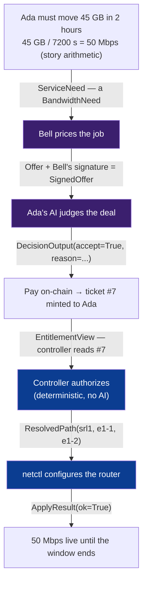
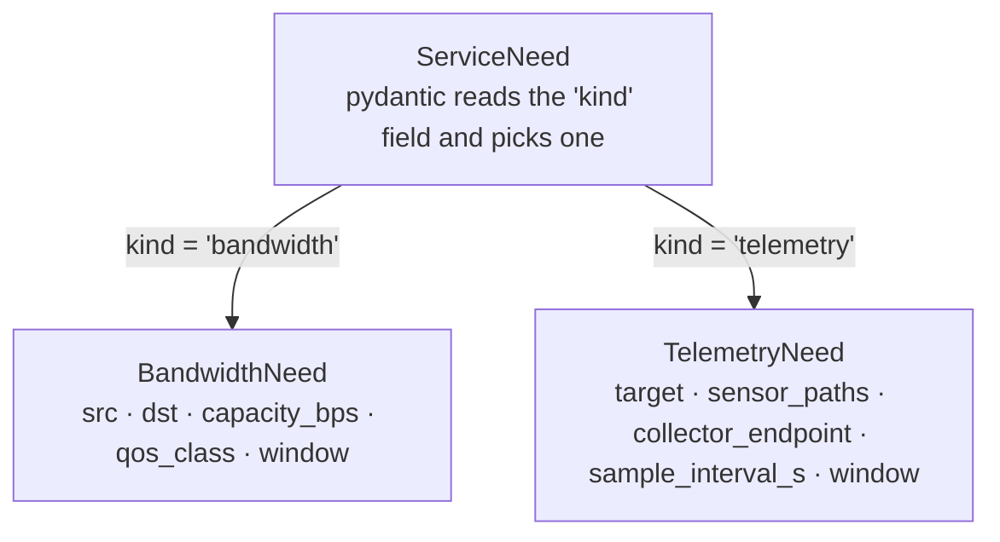
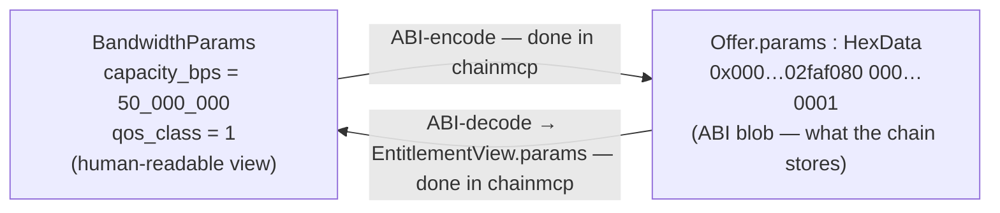
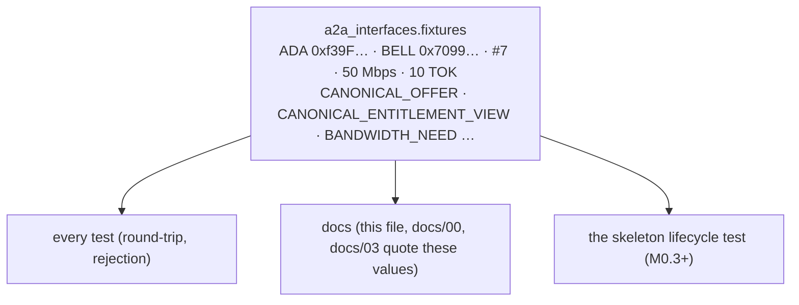
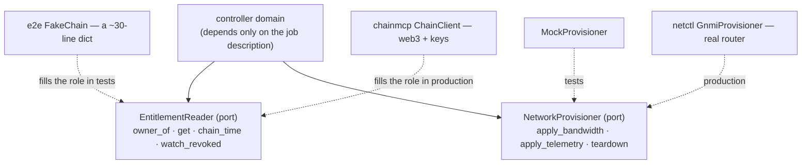

# 03a — Interfaces by example: how Ada's need becomes code

> **Status:** living teaching companion. `docs/03-interfaces.md` is the *authoritative*
> schema spec (terse field tables); this doc *teaches the same shapes by walking one real
> example through them*. Where the two ever disagree, `docs/03` wins and this gets fixed.
> **Read after:** `docs/00-the-story.md` (the story these values come from) ·
> `docs/02-architecture.md` (why `interfaces` is bedrock).
> **Companion:** `docs/03b-lifecycle-walkthrough.md` walks the same purchase as a *timeline*
> — what is on-chain vs off-chain, and which module touches each shape. This doc is the
> *nouns* (one shape at a time); 03b is the *verbs* (the hops in order).
> All numeric/address values below are quoted from `a2a_interfaces.fixtures` — the one
> source of truth (CLAUDE.md / `docs/04` §3). If you change a value, change it there.

---

## 0. The problem this whole package solves

Ada (an AI agent) wants to buy network bandwidth from Bell (another agent). For that deal
to happen, **five different programs** — Ada's brain, Bell's brain, the blockchain adapter,
the controller, and the router-configurator — must agree, *exactly*, on what an "offer" is,
what a "need" is, what an "entitlement" is. One disagreement (Bell calls it `price`, Ada
calls it `cost`) and the deal silently breaks.

`a2a_interfaces` is the **shared dictionary** all five programs read from. This doc follows
one purchase — *Ada buys 50 Mbps from Bell for 10 TOK, ticket #7* — and shows which shape
carries the deal at each hop, what the shape actually contains, and why it's built that way.

---

## 1. The spine: one purchase, one shape per hop

Every arrow below is a moment in the story; the label on the arrow is the **model from
`models.py` that carries the data across that gap.** That is the answer to "how does a need
turn into code" — at each step, a need *is* one of these objects.



The two purple boxes (Bell pricing, Ada judging) are the **only** places an AI decides
(CLAUDE.md rule 1). Everything else is shapes moving between deterministic code.

---

## 2. `models.py` — the nouns, walked through the story

Each subsection is one hop of the spine: the **moment**, the **real values**, the **shape**,
and the **why**.

### 2.1 The need → `BandwidthNeed` (a `ServiceNeed`)

**Motivation.** Ada has computed she needs 50 Mbps from `hostA` to `hostB` for a two-hour
window. She must say that to Bell in a way Bell's code can read without guessing.

**The code (built from `fixtures.BANDWIDTH_NEED`):**

```python
BandwidthNeed(
    src="hostA",
    dst="hostB",
    capacity_bps=50_000_000,          # 50 Mbps, in bits/second
    qos_class=1,
    window=TimeWindow(start=1757944800, end=1757952000),  # absolute unix seconds
)
```

**On the wire (snake_case JSON).** *On the wire* means: the data as it travels between two
programs, written as plain text (JSON) rather than as a live Python object.

```json
{"v": 0, "kind": "bandwidth", "src": "hostA", "dst": "hostB",
 "capacity_bps": 50000000, "qos_class": 1,
 "window": {"start": 1757944800, "end": 1757952000}}
```

**Who builds it, who reads it.** This shape lives entirely inside the `agents` module:
**Ada's agent *produces* it; Bell's agent *consumes* it.** To *produce* is to build the
object and then *serialize* it — flatten the live Python object into the plain JSON text
above, ready to send. To *consume* is to receive that text and *validate* it — turn it back
into a checked object, rejecting anything malformed at the door.

> **Status: PLANNED (M1.x).** `agents/` is an empty directory today; M0.2 builds only the
> shapes. The snippets below are what the consuming code *will* look like — shown so you can
> watch the shape do its job, not code that runs yet.

```python
# agents/ada/a2a_adapter.py — Ada SENDS (produce)
payload = need.model_dump(mode="json")          # serialize: object -> JSON dict
a2a_client.send(target="bell", body=payload)

# agents/bell/a2a_adapter.py — Bell RECEIVES (consume)
from pydantic import TypeAdapter
from a2a_interfaces.models import ServiceNeed
need = TypeAdapter(ServiceNeed).validate_python(raw)   # validate: JSON -> checked object
# ^ a need with capacity_bps=-5, or a missing field, is REJECTED right here —
#   at Bell's edge, before his pricing brain ever runs.
```

Validation happens in the *adapter* (Bell's edge), not deep inside his pricing logic. That
is the whole point of the shape: bad data dies at the door, so every step downstream of it
is simpler and can trust what it's handed. The A2A SDK is confined to `a2a_adapter.py`
(ADR-002) — the rest of the agent only ever touches typed objects, never the wire.

**Why it's shaped this way.**
- `capacity_bps` is a `Uint64` — a non-negative integer. Try to build it with `-5` and pydantic
  rejects it *at construction*, at Ada's edge, not three programs later. Bad data dies early.
- A *bandwidth* need and a *telemetry* need carry different facts (one needs a speed, the
  other needs sensor paths). So instead of one bloated shape with half its fields empty,
  there are two precise shapes, chosen by a `kind` tag — a **discriminated union**:



This makes the illegal state — "a bandwidth need that also carries telemetry sensor paths"
— *impossible to even construct*. The shape enforces the rule for free.

### 2.2 The quote → `Offer`, then `SignedOffer`

**Motivation.** Bell agrees to sell. But Ada (and later the blockchain) must be able to
*prove* Bell really offered these exact terms — a promise without a signature is worthless.

**The code (from `fixtures.CANONICAL_OFFER`):**

```python
Offer(
    provider="0x70997970C51812dc3A010C7d01b50e0d17dc79C8",  # Bell
    consumer="0x0000...0000",      # address(0) = open offer: anyone may fulfill (v0 default)
    service_type=0,                # 0 = bandwidth, 1 = telemetry
    resource_id="0x00...0007",     # this is resource #7
    params="0x...02faf080...01",   # ABI-encoded (capacity=50_000_000, qos=1) — see 2.3
    start_time=1757944800, end_time=1757952000,
    payment_token="0x5FbDB2315678afecb367f032d93F642f64180aa3",  # MockTOK
    price="10000000000000000000",  # 10 TOK as a decimal *string* (never a float)
    valid_until=1757946000,        # the offer itself expires at 14:20, even before the service window
    salt="0x...5A17", terms_hash="0x2222...2222",
)
```

**Why it's shaped this way.**
- **`Offer` serializes to `camelCase`** (`serviceType`, `resourceId`, `paymentToken`) — every
  *other* shape stays snake_case. The reason: this exact object gets hashed and signed, then
  verified by the Solidity contract, which uses camelCase. The bytes must match the contract
  **byte-for-byte**, so the Python shape bends to the chain's naming. The inconsistency is the
  design, not a slip.
- **Content and proof are separate shapes.** `Offer` is *what* Bell promises; `SignedOffer`
  wraps it with `signature` + a human-readable `terms_doc`. They split because they answer
  different questions ("what's the deal?" vs "who vouches for it?").
- **`price` is a decimal string**, not a number. Money in 18-decimal wei is far bigger than a
  float can hold without rounding — and rounding money is how you lose a cent and a lawsuit.

### 2.3 The translation gotcha → `params` (hex) vs `BandwidthParams` (decoded)

This is the single most "how does a need become code" moment, so it gets its own picture.

The capacity `50_000_000` and qos `1` live **twice**, in two forms:



- On-chain, the parameters are an opaque **byte blob** (`HexData`): two 32-byte words,
  `50_000_000` (hex `0x2faf080`) then `1`. That's what `Offer.params` holds.
- When the controller *reads* the entitlement, it wants the friendly view —
  `BandwidthParams(capacity_bps=50_000_000, qos_class=1)` — which is what `EntitlementView.params`
  holds.
- **Crucially, the encode/decode itself is NOT in this package.** `interfaces` only defines
  the two *shapes*; the keccak/ABI machinery that converts between them lives in `chainmcp`
  (rule 2/4). This package is shapes, never codecs.

### 2.4 The judgment → `DecisionOutput`

**Motivation.** Ada's AI looks at the offer and decides. This is judgment — but the rest of
the system can't consume free-form AI chatter; it needs a predictable answer.

```python
DecisionOutput(accept=True, reason="meets need; price within budget")
```

**Why.** The shape *forces* the AI's output into a clean boolean + reason, validated and
retried in code. It's the funnel that turns "one of the two AI judgment slots" back into
something deterministic code can branch on.

### 2.5 The ticket, as the controller sees it → `EntitlementView`

**Motivation.** Payment settled; ticket #7 now exists on-chain, owned by Ada. The controller
must *read* it to decide whether to honor it — but read-only; the controller never writes.

```python
EntitlementView(
    id=7, issuer="0x7099…79C8",  # minted by Bell
    service_type=0,
    resource_id=b"\x00..\x07",   # raw 32 bytes; round-trips to/from JSON as hex
    params=BandwidthParams(capacity_bps=50_000_000, qos_class=1),
    start_time=1757944800, end_time=1757952000,
    revoked=False, terms_hash=b"\x22"*32,
)
```

**Why.** It's a *decoded, read-only snapshot* — the `params` blob already turned into a
`BandwidthParams` (2.3), so the controller works with meaning, not bytes. `revoked` is a flag,
never a deletion (story ch. 8): an expired or revoked ticket still *exists* and stays readable.

### 2.6 Where, and did it work → `ResolvedPath` / `ResolvedNode` / `ApplyResult`

**Motivation.** The ticket says "resource #7." But `netctl` (the hands) configures a *real
device* — it needs concrete names, not an abstract id.

```python
ResolvedPath(device="srl1", ingress_if="ethernet-1/1", egress_if="ethernet-1/2")
# netctl acts, then answers:
ApplyResult(ok=True, detail="")
```

**Why.** The controller does the `#7 → srl1/ethernet-1/1` lookup (its `resource_map`, ADR-005)
and hands `netctl` only concrete names — that's what keeps `netctl` topology-agnostic (rule 6).
`ApplyResult` is the simple yes/no that flows back.

### 2.7 The bookkeeping → `SessionState`, `ErrorCode`

Two enums no single hop owns, but every hop touches:
- `SessionState`: `requested → authorized → active → torn_down` (and `failed` from anywhere).
- `ErrorCode`: `E_NOT_OWNER`, `E_EXPIRED`, `E_REVOKED`, `E_SCOPE`, … — so every module names a
  refusal the *same* way instead of inventing its own strings.

---

## 3. `fixtures.py` — why one example, imported everywhere

**Motivation.** The deadliest bug in a project like this is **drift**: the same example,
retyped by hand in five files, quietly disagreeing. (The M0.2 audit literally found ticket
#7's validity window stamped with two different epochs across the story and `docs/03`.)

**The idea.** Write the canonical purchase *once*, as real Python objects, and have everyone
import them. There is exactly one Ada, one Bell, one #7, one 10 TOK.



**Mechanism.** Import the object, don't retype the values:

```python
from a2a_interfaces.fixtures import CANONICAL_OFFER, CANONICAL_ENTITLEMENT_VIEW, ADA, BELL
```

Change the price in `fixtures.py` and it changes in the tests, the skeleton, and (by the
quoting rule) the docs — all at once. One source of truth, or none.

**Scope border (ink).** The `signature`, `salt`, and `terms_hash` in fixtures are
syntactically-valid **placeholders** (`signature = "0xab…ab"`). Real signing and keccak
hashing arrive in `chainmcp` at M1.5. Fixtures gives shared *example values*, not real crypto.

---

## 4. `ports.py` — the sockets that let modules connect

**Motivation.** The controller must read the chain and drive the network — but if it
*imports* `chainmcp` and `netctl` directly, then (a) you can't test it without a real chain
and real routers, and (b) it's one line away from touching a private key it must never see.

**The idea.** A **port** is a *job description, not a worker*. It says "whoever fills this
role must be able to do X, Y, Z" — and never names who. (In Python it's a `Protocol`: any
class with the right methods fits, no inheritance, no import needed.)



**Mechanism.** Because the controller only knows the *job description*, a 30-line fake dict
and the real web3 adapter are **interchangeable** — both satisfy `EntitlementReader`, so both
plug into the same socket. That is how the security logic is tested in milliseconds *and* run
for real with the exact same code (CLAUDE.md rule 7).

This is also *why the ports live in `interfaces`, not in `controller`*: a socket must sit in a
neutral place both the boss (controller) and the workers (chainmcp/netctl/fakes) can see —
without anyone importing upward and breaking the downhill rule (`docs/02` §1).

> Plain analogy: `ports.py` is a wall socket. The controller plugs in. It doesn't care whether
> a battery (the fake) or the power grid (real chainmcp) sits behind the wall — anything shaped
> like the plug works. `teardown`'s contract even says *"calling twice is a success"* — rule 8
> written straight into the job description.

---

## 5. See it yourself

```bash
# Build the canonical offer and watch it serialize to camelCase (mirrors Solidity):
uv run python -c "from a2a_interfaces.fixtures import CANONICAL_OFFER as o; print(o.model_dump_json(by_alias=True))"

# Watch the border reject bad data at construction:
uv run python -c "from a2a_interfaces.models import BandwidthNeed, TimeWindow; \
BandwidthNeed(src='a', dst='b', capacity_bps=-5, qos_class=1, window=TimeWindow(start=0,end=1))"
#   -> ValidationError: capacity_bps  Input should be greater than or equal to 0

# The whole package's tests (round-trips + rejections + fixtures):
uv run pytest interfaces/ -q
```

---

## 6. What this package is NOT (scope, in ink)

- **No behavior.** Shapes only — no signing, no keccak, no ABI codec, no I/O, no HTTP. Those
  live in `chainmcp` / `netctl` (rules 2, 4).
- **No real cryptography.** Signatures/hashes in fixtures are placeholders until M1.5.
- **Address validation is pattern-only** (`0x` + 40 hex), not EIP-55 checksum — checksum needs
  keccak, which belongs to `chainmcp`.
- **Nothing runs end-to-end yet.** These shapes are wired into a living lifecycle at **M0.3**
  (walking skeleton). Today they are a validated vocabulary, nothing more.
