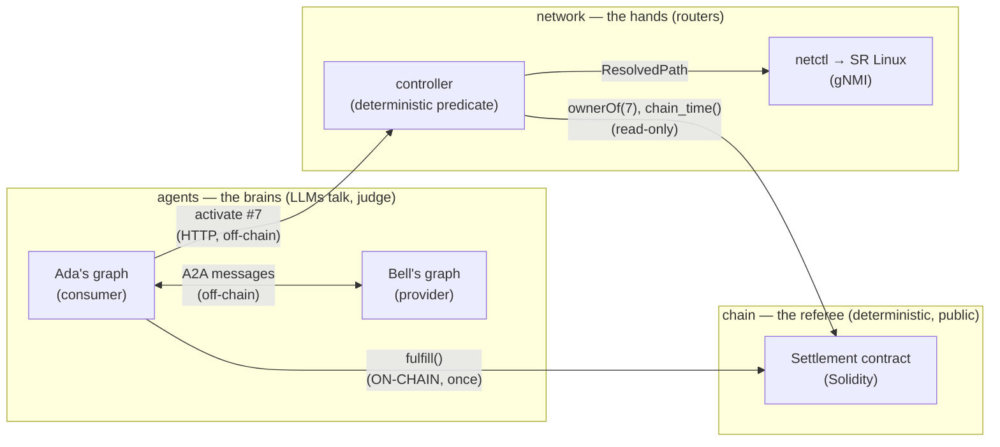
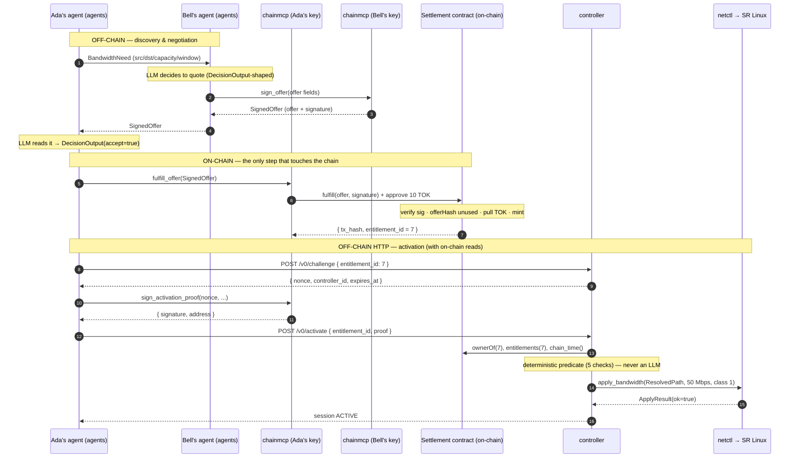
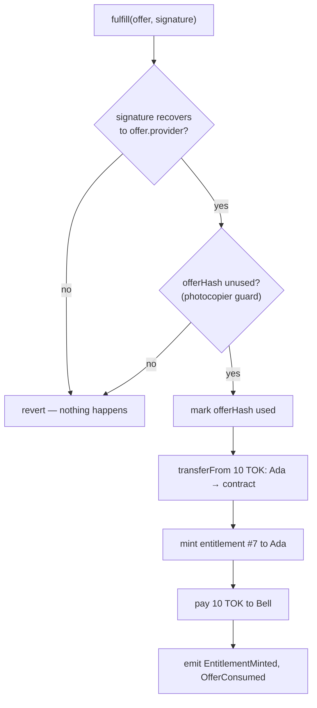
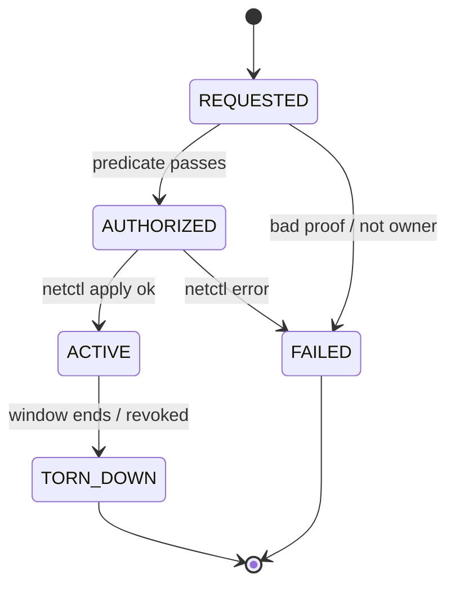

# 03b — Lifecycle walkthrough: what is on-chain, what is off-chain

> **Why this doc exists.** A natural first guess is that the whole negotiation —
> "I want bandwidth" / "here's my price" / "deal" — happens *on the blockchain*. It
> doesn't. Almost everything is plain off-chain messaging between two agents; the chain
> is touched at exactly **one** step. This walkthrough follows Ada buying 50 Mbps from
> Bell (ticket #7, 10 TOK) end to end, naming the real class in the real file at every
> step. It is the narrative companion to [`03-interfaces.md`](03-interfaces.md) and
> [`03a-interfaces-walkthrough.md`](03a-interfaces-walkthrough.md); the concepts come
> from [`00-the-story.md`](00-the-story.md). Its code-level twin —
> *how the v0 skeleton actually runs this lifecycle* — is
> [`03c-skeleton-walkthrough.md`](03c-skeleton-walkthrough.md).

All classes named below live in
[`interfaces/src/a2a_interfaces/models.py`](../interfaces/src/a2a_interfaces/models.py)
unless stated otherwise. The canonical values (Ada, Bell, #7, 50 Mbps, 10 TOK) come from
[`interfaces/src/a2a_interfaces/fixtures.py`](../interfaces/src/a2a_interfaces/fixtures.py).

---

## The one-sentence answer

The **conversation and the offer are off-chain signed messages.** The blockchain is
touched once — when Ada *redeems* Bell's offer — because that single instant (money and
ticket changing hands between strangers) is the only place someone could cheat. The chain
is the **referee for the trade**, not the host of the chat.

---

## Three worlds



- **`agents`** hold the only two LLM judgment slots: the provider's *quote/decline* and
  the consumer's *accept/reject*. Nothing else is an LLM (CLAUDE.md rule 1).
- **`contracts`** (the Solidity settlement) is the referee. It is written to *once* per
  purchase and *read* many times.
- **`controller` + `netctl`** turn an owned ticket into real router config. The controller
  *reads* the chain but never signs (rule 2).

---

## The full lifecycle (one picture)



---

## Step by step — the real class, in the real file

### Step 1 — Ada has a need → `BandwidthNeed`
Ada's agent expresses what it wants as a `BandwidthNeed`
([models.py:105](../interfaces/src/a2a_interfaces/models.py#L105)). **Yes — this is the
class you asked about.** Its fields:

```python
class BandwidthNeed(_Frozen):
    v: Literal[0] = 0
    kind: Literal["bandwidth"] = "bandwidth"
    src: str          # provider-catalog name (e.g. "hostA"), NOT a device name
    dst: str
    capacity_bps: Uint64
    qos_class: Uint8
    window: TimeWindow
```

The canonical instance is `BANDWIDTH_NEED` in
[fixtures.py:52](../interfaces/src/a2a_interfaces/fixtures.py#L52). Note `src="hostA"` is a
*catalog* name from Bell's provider card — never a topology/device name; that mapping is
the controller's secret (ADR-005).

`BandwidthNeed` is one arm of the discriminated union
`ServiceNeed = Union[BandwidthNeed, TelemetryNeed]`
([models.py:130](../interfaces/src/a2a_interfaces/models.py#L130)); pydantic picks the arm
by the `kind` literal.

- **Module:** `agents` (Ada). **Shape from:** `interfaces`. **On/off-chain:** off-chain.

### Step 2 — Ada asks Bell; Bell's LLM decides to quote
Ada sends the `BandwidthNeed` over the **A2A protocol** (agent-to-agent messaging, confined
to `agents/*/a2a_adapter.py`, ADR-002). Bell's LLM makes a judgment call: quote or decline.

- **Module:** `agents` both sides. **On/off-chain:** off-chain. This is the "hey, I want
  bandwidth / got it" chat — and it really is just messages.

### Step 3 — Bell signs the offer → `Offer` + `SignedOffer`  ← the offer is born here
Bell fills in an `Offer` ([models.py:136](../interfaces/src/a2a_interfaces/models.py#L136)) —
the twelve fields that mirror the Solidity EIP-712 struct **field for field**:

```python
class Offer(BaseModel):           # frozen, serializes to camelCase to match Solidity
    provider: Address
    consumer: Address             # 0x0 => open offer (anyone may fulfill)
    service_type: Uint8           # 0 = bandwidth
    resource_id: Bytes32Hex       # Bell's opaque name for the A→B path
    params: HexData               # ABI-encoded (capacity_bps, qos_class)
    start_time: Uint64
    end_time: Uint64
    payment_token: Address
    price: DecimalString          # "10000000000000000000" — wei, never a float
    valid_until: Uint64           # a quote expiry, not a standing promise
    salt: Bytes32Hex              # serial number → makes each offer hash unique
    terms_hash: Bytes32Hex        # keccak of the off-chain SLA doc
```

The signing itself happens in **`chainmcp`** (the *only* key holder, rule 2) via the
`sign_offer` MCP tool. The output is a `SignedOffer`
([models.py:164](../interfaces/src/a2a_interfaces/models.py#L164)):

```python
class SignedOffer(_Frozen):
    v: Literal[0] = 0
    offer: Offer
    signature: Signature          # 65-byte hex
    terms_doc: dict[str, Any]     # human-readable SLA; its keccak == offer.terms_hash
```

Canonical instances: `CANONICAL_OFFER`
([fixtures.py:68](../interfaces/src/a2a_interfaces/fixtures.py#L68)) and
`CANONICAL_SIGNED_OFFER` ([fixtures.py:83](../interfaces/src/a2a_interfaces/fixtures.py#L83)).

- **Shape from:** `interfaces`. **Signing in:** `chainmcp`. **On/off-chain:** **off-chain.**
  Bell can now go offline. The chain has never seen this offer — it's signed bytes in a
  message.

> **Correcting a common mental model:** the offer is *not* created "when they agree." The
> offer *is* the proposal; agreeing comes next and means *spending* it. There is no
> separate "we agree" document.

### Step 4 — Ada reads it and decides → `DecisionOutput`
Ada's LLM does its one tiny job and emits a `DecisionOutput`
([models.py:176](../interfaces/src/a2a_interfaces/models.py#L176)) — the **only** consumer
judgment slot in the system:

```python
class DecisionOutput(_Frozen):
    accept: bool
    reason: str
```

Canonical: `DECISION_ACCEPT`
([fixtures.py:105](../interfaces/src/a2a_interfaces/fixtures.py#L105)). Still off-chain —
`accept=True` is only an *intention*.

### Step 5 — Ada redeems → `fulfill()`  ← THE one on-chain moment
Ada calls the settlement contract's `fulfill(offer, signature)` (via the `fulfill_offer`
tool in `chainmcp`, which does the ERC-20 `approve` first). In **one atomic transaction**
([03-interfaces.md §2.2](03-interfaces.md)):



Six effects, one clunk. If *any* check fails, **all of it unwinds**. The `salt` is what
makes each offer's hash unique so the "used" ledger can punch it exactly once.

- **Module:** `contracts` (on-chain) + `chainmcp` (submits the tx). **On/off-chain:**
  **ON-CHAIN — the only write.** This is "they agreed," made irreversible.

### Step 6 — Activation: prove ownership → challenge/response
At 14:02 Ada asks Bell's **controller** to switch #7 on. This is HTTP/JSON
([03-interfaces.md §3](03-interfaces.md)), *off-chain*, but the controller *reads* the chain
to check ownership. Three calls (deliberately):

1. `POST /v0/challenge {entitlement_id: 7}` → controller returns a fresh `nonce`,
   `controller_id`, `expires_at`.
2. `sign_activation_proof` in **`chainmcp`** signs the bound string
   `a2a-activate|{controller_id}|{nonce}|{entitlement_id}|{expires_at}`.
3. `POST /v0/activate {entitlement_id, proof}`.

The proof binds controller + nonce + ticket + expiry, so a copied proof is useless
(wrong nonce / expired). There is no pydantic class for the proof in v0 — it's an HTTP
body; the *errors* it can raise are the `ErrorCode` enum
([models.py:62](../interfaces/src/a2a_interfaces/models.py#L62)): `E_NOT_OWNER`,
`E_BAD_PROOF`, `E_NONCE_REUSED`, …

### Step 7 — The predicate: deterministic, never an LLM
The controller reads the chain through the `EntitlementReader` **Protocol**
([ports.py:17](../interfaces/src/a2a_interfaces/ports.py#L17)):

```python
class EntitlementReader(Protocol):
    def owner_of(self, entitlement_id: int) -> str: ...
    def get(self, entitlement_id: int) -> EntitlementView: ...
    def chain_time(self) -> int: ...     # block.timestamp — the only clock (ADR-004)
    def watch_revoked(self, callback) -> None: ...
```

`get(7)` returns an `EntitlementView`
([models.py:186](../interfaces/src/a2a_interfaces/models.py#L186); canonical
`CANONICAL_ENTITLEMENT_VIEW` at
[fixtures.py:90](../interfaces/src/a2a_interfaces/fixtures.py#L90)) — the decoded read-only
view whose `params` is a `BandwidthParams`
([models.py:80](../interfaces/src/a2a_interfaces/models.py#L80)). The predicate then runs
five arithmetic checks (owner? not expired by `chain_time()`? not revoked? request within
terms? no conflicting session?). All boring on purpose — a creative bouncer is a security
hole.

- **Module:** `controller` (its domain imports *no* I/O — only these Protocols, rule 4).

### Step 8 — Provisioning: paper → physics → `ResolvedPath`
The controller translates `resource_id 0xabc…` through its private
`controller/resource_map.yaml` into a `ResolvedPath`
([models.py:214](../interfaces/src/a2a_interfaces/models.py#L214)):

```python
class ResolvedPath(_Frozen):
    device: str       # "srl1"
    ingress_if: str   # "ethernet-1/1"
    egress_if: str    # "ethernet-1/2"
```

(canonical `RESOLVED_PATH` at
[fixtures.py:103](../interfaces/src/a2a_interfaces/fixtures.py#L103)). It hands that to
**`netctl`** through the `NetworkProvisioner` Protocol
([ports.py:31](../interfaces/src/a2a_interfaces/ports.py#L31)):

```python
class NetworkProvisioner(Protocol):
    def apply_bandwidth(self, session_id, path: ResolvedPath,
                        capacity_bps, qos_class) -> ApplyResult: ...
    def teardown(self, session_id) -> ApplyResult: ...   # MUST be idempotent
    def health(self) -> bool: ...
```

`netctl` returns an `ApplyResult` ([models.py:226](../interfaces/src/a2a_interfaces/models.py#L226))
and speaks gNMI to SR Linux. It receives *concrete device names only* and never knows
tickets or chains exist (rule 6).

### Step 9 — Teardown: chain time decides
At 16:00 by `chain_time()` (not the OS clock — ADR-004) the controller calls
`teardown(session_id)`, which is idempotent (rule 8). The session walks the
`SessionState` enum ([models.py:52](../interfaces/src/a2a_interfaces/models.py#L52)):



---

## On-chain vs off-chain — the whole split on one page

| Step | What happens | Class / function | File | Chain? |
|---|---|---|---|---|
| 1 | Ada's need | `BandwidthNeed` | `models.py` | off |
| 2 | Ask Bell; Bell's LLM quotes | A2A message + LLM | `agents/*/a2a_adapter.py` | off |
| 3 | Bell signs the offer | `Offer` → `SignedOffer` | `models.py` (sign in `chainmcp`) | **off** |
| 4 | Ada's LLM accepts | `DecisionOutput` | `models.py` | off |
| 5 | **Redeem / swap** | `fulfill(offer, signature)` | `contracts` (via `chainmcp`) | **ON** |
| 6 | Prove ownership | challenge/response + `ErrorCode` | HTTP §3 + `chainmcp` | off (reads chain) |
| 7 | Predicate | `EntitlementReader`, `EntitlementView` | `ports.py`, `models.py` | reads chain |
| 8 | Provision | `ResolvedPath` → `NetworkProvisioner` → `ApplyResult` | `ports.py`, `models.py`, `netctl` | off |
| 9 | Teardown | `teardown()`, `SessionState` | `ports.py`, `models.py` | reads chain (clock) |

**The takeaway:** the offer (step 3) and the accept (step 4) are *off-chain signed
messages*. The chain is written exactly once (step 5). Why put only that step on-chain?
Because that is the only moment where money and the ticket change hands between strangers
— the only place a referee is needed.
