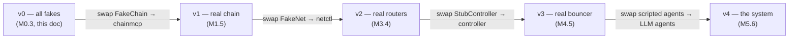
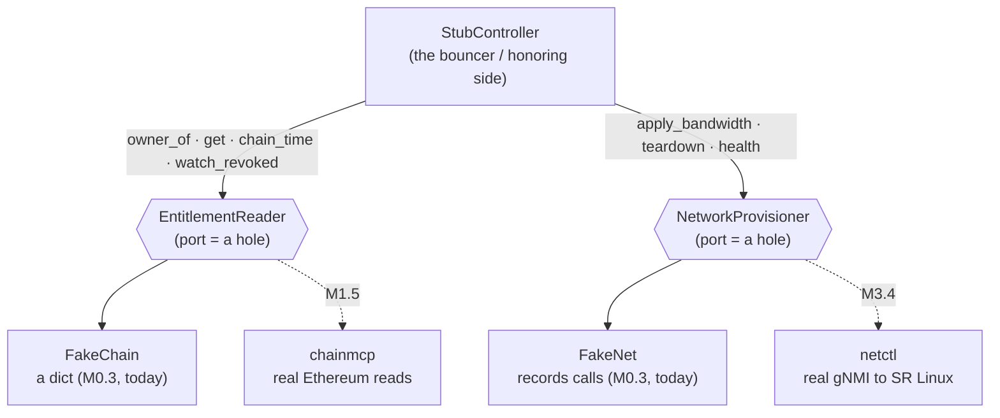
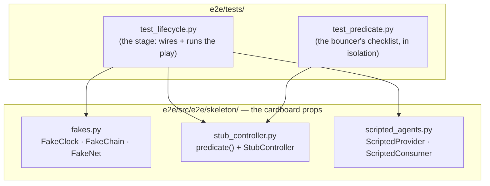
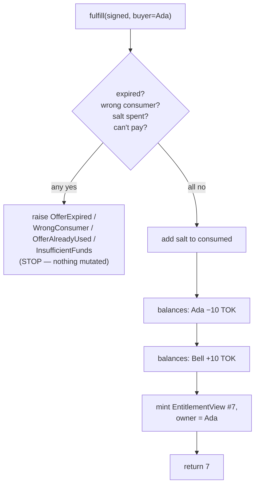
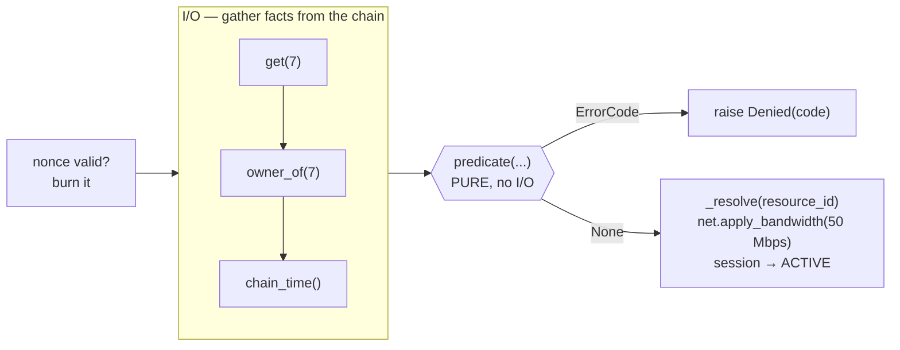
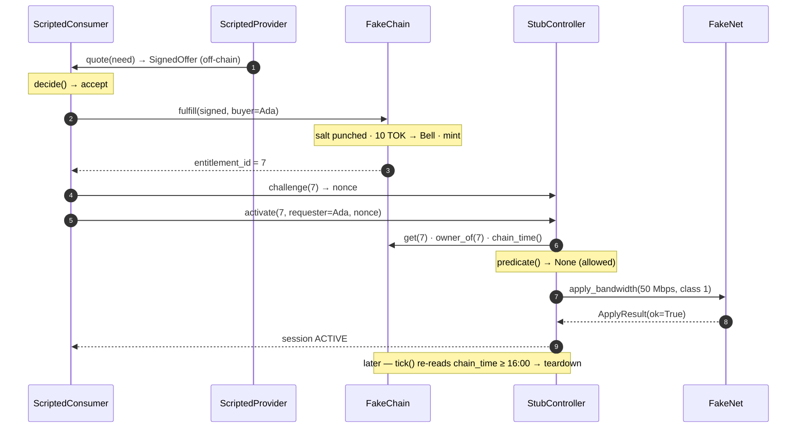
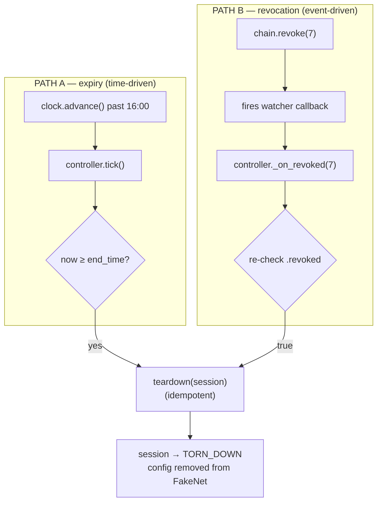
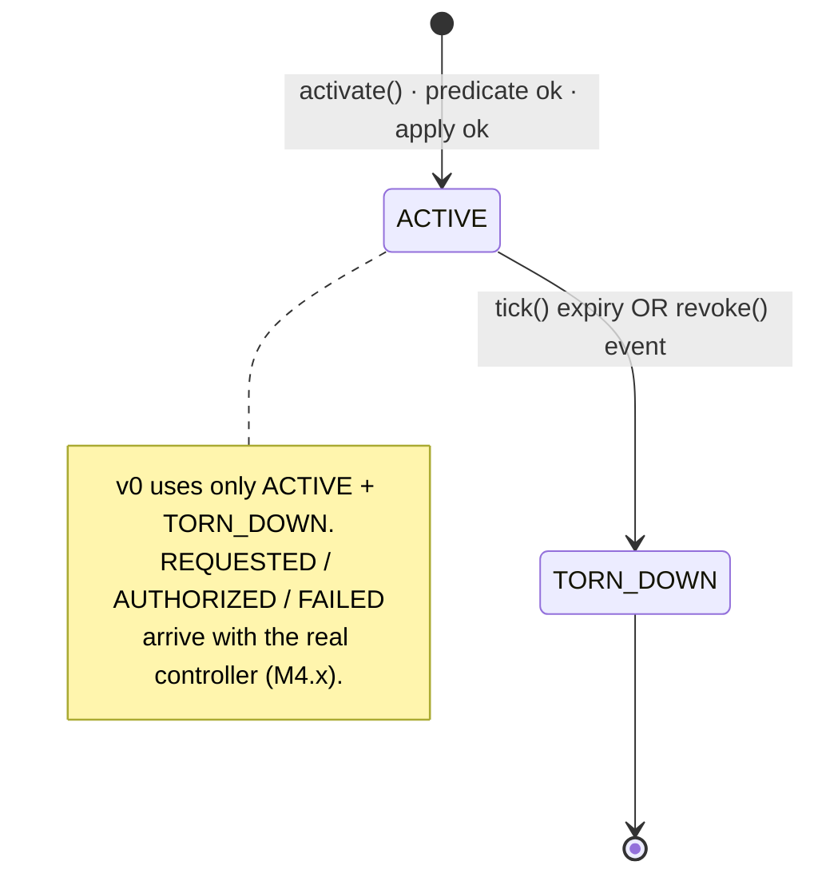

# 03c — Walking skeleton walkthrough: the v0 code, piece by piece

> **Why this doc exists.** [`03b`](03b-lifecycle-walkthrough.md) tells you *what* happens in
> Ada's purchase and *where* (on-chain vs off-chain). This doc is its code-level twin: it
> opens up the **M0.3 walking skeleton** — the ~360 lines that actually *run* that lifecycle
> with everything faked — and shows what each class, method, and line is *for*. It is written
> for a reader who has never met a Python `Protocol`, a callback, or a "fake," and carries
> them the whole way. Companions: [`03b`](03b-lifecycle-walkthrough.md) (the concept),
> [`01` M0.3](01-implementation-plan.md) (the milestone), [`evidence/M0.3.md`](evidence/M0.3.md)
> (the proof it runs).
>
> All code lives in [`e2e/src/e2e/skeleton/`](../e2e/src/e2e/skeleton/) and is driven by
> [`e2e/tests/test_lifecycle.py`](../e2e/tests/test_lifecycle.py). Canonical values
> (Ada, Bell, #7, 50 Mbps, 10 TOK) come from
> [`a2a_interfaces.fixtures`](../interfaces/src/a2a_interfaces/fixtures.py) — never retyped here.

## The one-sentence answer

The walking skeleton is the **whole play performed with cardboard props**: real *shapes* and
real *wiring*, but a blockchain that is secretly a dict, a router that just writes down what
it was told, and AI agents whose answers are hard-coded — so the architecture's *joints* are
proven, and re-proven in CI, two phases before any real organ exists.

---

## 1. The pain this removes (motivation before mechanism)

Imagine building the project the obvious way: spend a month perfecting the smart contract,
then a month on the router automation, then a month on the agents — and only *then* try to
make them talk. The risk is brutal: the first time the pieces meet is the day everything is
supposedly "done," and that is the day you discover the contract returns a ticket id the
controller never expected, or the controller asks the router for a field the router doesn't
have. An integration bug found on that day costs you the defense; the same bug found today
costs you ten minutes.

The **walking skeleton** is the cure. Perform the entire lifecycle —
discover → quote → decide → settle → activate → teardown — *on day one*, end to end, with
every hard part replaced by a **fake**.

> **Jargon: a "fake" (or "mock")** — a cheap stand-in object used in tests instead of the
> real thing. Our `FakeChain` is a Python dictionary pretending to be Ethereum. It does maybe
> 1% of what Ethereum does, and that is the *point*: it does *just enough* to make the joints
> meet.

Then you swap props for real organs **one at a time**, keeping the play green after every
swap:



The skeleton test never leaves CI. Every later milestone has to keep it green — which means
no later milestone can quietly break an integration that worked before.

---

## 2. The one idea everything rests on: ports and props

How can the same controller code work with a fake chain today and a real blockchain later,
*unchanged*? Because the controller never names a concrete chain. It talks only to a **port**.

> **Jargon: a "port"** — a named list of methods one part of the system promises to talk to,
> without caring who is behind it. In Python a port is a `typing.Protocol`.
>
> **Jargon: a `Protocol`** — a *structural* interface. Any class that simply *has the right
> methods* counts as fitting the port — no inheritance, no registration. The duck-typing rule:
> "if it has `owner_of`, `get`, `chain_time`, `watch_revoked`, it *is* an `EntitlementReader`."

The controller has exactly two holes, defined back in M0.2
([`ports.py`](../interfaces/src/a2a_interfaces/ports.py)): `EntitlementReader` (the read-side
of the chain) and `NetworkProvisioner` (the hands on the router). Today cardboard fills both
holes; later, real organs fill the *same* holes:



This is why the *first* test in the suite checks nothing about behaviour — only that the
cardboard is the right *shape* ([test_lifecycle.py:62](../e2e/tests/test_lifecycle.py#L62)):

```python
def test_fakes_satisfy_ports():
    assert isinstance(chain, EntitlementReader)      # FakeChain fills the chain hole
    assert isinstance(net, NetworkProvisioner)       # FakeNet fills the net hole
```

`isinstance(x, SomeProtocol)` returns `True` here only if `x` has *all* the methods the
protocol lists. Forget to give `FakeChain` a `chain_time()` and this test turns red
immediately — a tripwire that keeps the props swap-compatible with the real organs.
This is CLAUDE.md **rule 7** ("mocks implement the same Protocol as real adapters") made
mechanical.

---

## 3. The cast: three prop files + one test file



Read them in story order: the props that hold *data* (`fakes.py`), the props that hold
*judgment* (`scripted_agents.py`), then the *bouncer* that ties them together
(`stub_controller.py`), then the *stage* that runs the whole thing (`test_lifecycle.py`).

---

## 4. `fakes.py` — the props that hold data

[`fakes.py`](../e2e/src/e2e/skeleton/fakes.py). Three classes.

### 4a. `FakeClock` — a clock you can fast-forward

[fakes.py:57](../e2e/src/e2e/skeleton/fakes.py#L57). The real clock is "what time the
blockchain thinks it is" (`block.timestamp`). In a test you cannot wait two real hours for an
entitlement to expire, so the fake clock is just **one integer you can shove forward**:

```python
class FakeClock:
    def __init__(self, now): self._now = now
    def now(self):           return self._now
    def advance(self, secs): self._now += secs
```

Why a class and not a loose `now = 13_30`? Because several parts of the code ask for the time
at *different moments* and each must see the *current* value. A shared object guarantees one
truth; copied variables would let two parts disagree — exactly the drift
[ADR-004](adr/004-chain-time-canonical-clock.md) ("chain time is the only clock") forbids. In
the test it starts at `1757943120` (≈13:32) and we later `advance(1800)` (30 min) to 14:02.

### 4b. `FakeChain` — a blockchain that is really a dict

[fakes.py:70](../e2e/src/e2e/skeleton/fakes.py#L70). The star prop. Ethereum does payment,
NFT minting, signature checks, gas. `FakeChain` keeps the *bookkeeping only*, in plain
containers:

```python
self.balances = balances              # {address: token_count} — literally two numbers
self._next_id = next_id               # the next ticket number to hand out
self.consumed: set[str] = set()       # salts already spent (the "punched serials" ledger)
self._owners: dict[int, str] = {}     # {ticket_id: owner_address}
self._entitlements: dict[int, EntitlementView] = {}   # {ticket_id: the ticket's terms}
self._watchers: list = []             # callbacks to ring on revoke (see §6e)
```

> **Jargon: a `set`** — a bag holding each item at most once, with instant "is X in here?"
> lookup. Perfect for "which salts are spent?"; you never want one counted twice.
> **Jargon: a `dict`** — a lookup table, `key → value`. `_owners[7]` answers "who owns #7?".
> **Jargon: a "salt"** — a unique number stamped on each offer so its fingerprint is
> one-of-a-kind, like a banknote's serial number. The `consumed` set is the list of serials
> already cashed.

**`fulfill()` — the one chain write, faked** ([fakes.py:89](../e2e/src/e2e/skeleton/fakes.py#L89)).
This is the entire "money and ticket change hands" instant. Its shape is the lesson:



```python
def fulfill(self, signed, buyer):
    offer = signed.offer
    if self._clock.now() > offer.valid_until:                 # ALL checks first,
        raise OfferExpired(offer.valid_until)                 # in the order M1.3's
    if int(offer.consumer, 16) != 0 and offer.consumer != buyer:  # contract will
        raise WrongConsumer(buyer)                            # revert in
    if offer.salt in self.consumed:
        raise OfferAlreadyUsed(offer.salt)
    if self.balances.get(buyer, 0) < int(offer.price):
        raise InsufficientFunds(buyer)
    # checks done — nothing below can fail
    self.consumed.add(offer.salt)            # punch the serial
    self.balances[buyer] -= int(offer.price) # Ada pays
    self.balances[offer.provider] += int(offer.price)  # Bell receives
    entitlement_id = self._next_id; self._next_id += 1
    self._owners[entitlement_id] = buyer
    self._entitlements[entitlement_id] = EntitlementView(... from offer ...)
    return entitlement_id
```

> **Jargon: "atomic / all-or-nothing"** — either every effect happens or none does. The real
> chain guarantees this with a transaction: a revert rolls back *every* storage write already
> made, so the contract may check and mutate in any order. Python has no rollback, so the fake
> earns atomicity with **ordering alone**: every check runs *before the first mutation*, and a
> rejected `fulfill` literally never reaches the lines that move money. That ordering is why
> [the replay test](../e2e/tests/test_lifecycle.py#L108) can prove "Bell was paid once, not
> twice," and why the three deny-path tests
> ([expired / targeted / underfunded](../e2e/tests/test_lifecycle.py#L175)) can each assert the
> world is untouched. Those four tests are the parity spec M1.3's Foundry revert tests must
> match, check for check.

The **read side** is the `EntitlementReader` port the controller uses
([fakes.py:140](../e2e/src/e2e/skeleton/fakes.py#L140)): `owner_of(id)` → the owner,
`get(id)` → the ticket, `chain_time()` → forwards to the clock, `watch_revoked(cb)` → files a
callback. Note the controller never touches the clock directly; it asks *the chain* for the
time, exactly as it will ask the real chain later.

And `revoke()` ([fakes.py:131](../e2e/src/e2e/skeleton/fakes.py#L131)) — Bell cancelling a
ticket — is a **flag flip, not a delete** (invariant I5: a revoked ticket still exists and is
readable):

```python
def revoke(self, id):
    view = self._entitlements[id]
    self._entitlements[id] = view.model_copy(update={"revoked": True})   # immutable → copy
    for callback in self._watchers:        # ring everyone watching
        callback(id)
```

> **Why `model_copy` instead of `view.revoked = True`?** The ticket is a *frozen* (immutable)
> pydantic object from M0.2 — editing in place is forbidden, on purpose, so nobody can quietly
> mutate a ticket after it is read. To "change" it you make a fresh copy with one field
> updated.

### 4c. `FakeNet` — a router that writes down what it was told

[fakes.py:153](../e2e/src/e2e/skeleton/fakes.py#L153). A real router turns
`apply_bandwidth` into gNMI commands over the wire. The fake just **records the call** so a
test can later check "did the controller really ask for 50 Mbps?":

```python
def apply_bandwidth(self, session_id, path, capacity_bps, qos_class):
    self.applied[session_id] = {"path": path, "capacity_bps": capacity_bps, "qos_class": qos_class}
    return ApplyResult(ok=True)

def teardown(self, session_id):
    self.applied.pop(session_id, None)     # remove if present; do nothing if absent
    self.torn_down.append(session_id)
    return ApplyResult(ok=True)
```

> **Jargon: "idempotent"** — doing it twice is the same as doing it once, no error. See
> `teardown`: `applied.pop(session_id, None)` removes the key *if present* and silently does
> nothing otherwise (that is what the `None` default buys). So a second teardown succeeds
> quietly. This matters because both teardown paths (§6) can fire on the same session, and the
> second must not crash — CLAUDE.md **rule 8**.

`apply_telemetry` exists (the port requires it) but `raise NotImplementedError`s — no M0.3
test needs it. An honest "not yet" beats a fake that lies.

---

## 5. `scripted_agents.py` — the props that hold judgment

[`scripted_agents.py`](../e2e/src/e2e/skeleton/scripted_agents.py), the smallest file on
purpose:

```python
class ScriptedProvider:
    def quote(self, need): return CANONICAL_SIGNED_OFFER   # Bell always offers the standard deal

class ScriptedConsumer:
    def decide(self, need, offer): return DECISION_ACCEPT   # Ada always says yes
```

In the finished system these two methods are the **only** places an LLM makes a judgment call
(CLAUDE.md rule 1). We fake them for two reasons: an LLM is slow, costs money, and answers
differently each run — useless for a test that must pass *identically* in CI forever; and two
new technologies should never land in one milestone (real agents are M5). The *shapes* they
return (`SignedOffer` at [provider line 17](../e2e/src/e2e/skeleton/scripted_agents.py#L17),
`DecisionOutput` at [consumer line 23](../e2e/src/e2e/skeleton/scripted_agents.py#L23)) are
real; only the *decision* is canned.

---

## 6. `stub_controller.py` — the bouncer

[`stub_controller.py`](../e2e/src/e2e/skeleton/stub_controller.py) has two distinct halves: a
**pure function** (the predicate) and a **stateful object** (the controller).

### 6a. The predicate — a pure decision

[stub_controller.py:55](../e2e/src/e2e/skeleton/stub_controller.py#L55):

```python
def predicate(view, owner, requester, now, active_ids) -> ErrorCode | None:
    if requester != owner:               return ErrorCode.E_NOT_OWNER
    if now < view.start_time:             return ErrorCode.E_NOT_STARTED
    if now >= view.end_time:              return ErrorCode.E_EXPIRED
    if view.revoked:                      return ErrorCode.E_REVOKED
    if view.service_type not in (0,):     return ErrorCode.E_SCOPE
    if view.id in active_ids:             return ErrorCode.E_CONFLICT
    return None                           # None == "all clear"
```

Note the scope line: telemetry (serviceType 1) is a perfectly real service in docs/03, but v0's
controller only knows `apply_bandwidth` — so the honest scope set is `(0,)`. Admitting a
service the controller cannot deliver would pass the checklist and then crash mid-provision;
the tuple widens when the telemetry translator exists (M3.3/M4.3). The deny order is also part
of the contract — "who" is checked before state, so a revoked ticket shown by a non-owner
reports `E_NOT_OWNER` (pinned by the `order_who_before_state` test).

> **Jargon: "pure function"** — its answer depends *only* on its arguments, and it changes
> nothing in the world (no clock, no chain, no files). Notice it never *fetches* anything:
> `now`, `owner`, `active_ids` are all handed in.

Why is purity worth insisting on?

1. **Testable in microseconds.** [test_predicate.py](../e2e/tests/test_predicate.py) calls it
   nine times — one accept, eight named denials — with no blockchain in sight.
2. **It is the security core.** Authorization is "boring arithmetic," never creative AI. A
   predictable bouncer cannot be sweet-talked (rule 1).
3. **It moves house unchanged.** At M4.1 this exact function is lifted into
   `controller/domain.py`. Because it imports no I/O, the move is copy-paste.

It returns the *first* problem found, or `None` for OK. (Beginner trap: `None` means "yes,
allowed" — see §8.)

### 6b. `StubController.__init__` — wiring + one subtle line

[stub_controller.py:92](../e2e/src/e2e/skeleton/stub_controller.py#L92):

```python
def __init__(self, chain: EntitlementReader, net: NetworkProvisioner):
    self._chain = chain          # ← the PORT type, not a concrete FakeChain
    self._net = net
    self._sessions = {}; self._open_nonces = set()
    self._nonce_seq = 0; self._session_seq = 0
    self._chain.watch_revoked(self._on_revoked)   # "phone me if any ticket is revoked"
```

> **Jargon: "dependency injection"** — the controller does not *build* its chain and net; they
> are *handed in*. That is the whole reason a test can hand it cardboard while production hands
> it real adapters. The type hints name the *ports*, shouting "I don't care which
> implementation."

The last line wires the **observer pattern**: the controller gives the chain a callback
(`self._on_revoked`) to ring later. We will watch it fire in §6e.

> **Jargon: a "callback"** — a function you hand to another object so *it* can call *you* back
> when something happens. It inverts the usual direction: here the chain calls the controller.

### 6c. `activate()` — the bouncer doing the job

[stub_controller.py:108](../e2e/src/e2e/skeleton/stub_controller.py#L108). Read it as
**fetch → decide → act**:



```python
def activate(self, entitlement_id, requester, nonce):
    if nonce not in self._open_nonces:           # (1) real, unused stub?
        raise Denied(ErrorCode.E_NONCE_REUSED)
    self._open_nonces.discard(nonce)             # (2) burn it — single use

    view  = self._chain.get(entitlement_id)      # (3) FETCH facts
    owner = self._chain.owner_of(entitlement_id)
    now   = self._chain.chain_time()
    active_ids = {s.entitlement_id for s in self._sessions.values()
                  if s.state == SessionState.ACTIVE}

    error = predicate(view, owner, requester, now, active_ids)   # (4) DECIDE (pure)
    if error is not None:
        raise Denied(error)

    session_id = f"sess-{self._session_seq}"; self._session_seq += 1   # (5) ACT
    path = _resolve(view.resource_id)            # ticket's opaque id → real device/ports
    result = self._net.apply_bandwidth(session_id, path,
                                       view.params.capacity_bps, view.params.qos_class)
    if not result.ok:
        raise Denied(ErrorCode.E_NETWORK)        # router refused → never reaches ACTIVE
    self._sessions[session_id] = Session(session_id, entitlement_id, SessionState.ACTIVE)
    return session_id
```

That **fetch → decide → act** ordering is the architecture's spine: all I/O up front, one pure
decision in the middle, effects at the end. The real controller keeps exactly this shape.

> **Jargon: a "nonce"** — a one-time word ("number used once"). `challenge()`
> ([line 101](../e2e/src/e2e/skeleton/stub_controller.py#L101)) mints one; `activate()` requires
> it and immediately burns it, so a recorded "I'm the owner" proof cannot be replayed. Two v0
> honesty notes: the nonce is not yet *bound* to a ticket or requester (a nonce issued for #7
> would activate #8 — binding arrives with the signed proof at M4.2), and a set cannot tell
> "reused" from "never issued", so both surface as `E_NONCE_REUSED` until M4.2's real store.
> **Jargon: `Denied`** — a custom exception that *carries an `ErrorCode`*, so the caller (and
> the test) sees exactly *why* the bouncer said no: `exc.value.code == ErrorCode.E_NOT_OWNER`.

`_resolve` ([line 36](../e2e/src/e2e/skeleton/stub_controller.py#L36)) is the
paper-to-physics translation — the ticket's abstract `resource_id` →
`srl1, ethernet-1/1 → ethernet-1/2`. In v0 it is a one-entry dict standing in for the real
`resource_map.yaml` (M4.3); it is the *only* place that knows topology, which is rule 6.

### 6d. The happy lifecycle, as a sequence



### 6e. The two ways a session ends

A session can die two ways, and the skeleton uses two *different* mechanisms — deliberately,
because the real controller (M4.5) does the same: expiry is **time-driven** (a timer wakes and
re-checks the clock), revocation is **event-driven** (a chain event fires immediately).



`tick()` ([line 141](../e2e/src/e2e/skeleton/stub_controller.py#L141)) is **polling** — "wake,
read the clock, end anything past its `end_time`." `_on_revoked()`
([line 150](../e2e/src/e2e/skeleton/stub_controller.py#L150)) is the **callback** from §6b
finally ringing; it re-reads the ticket before acting:

```python
def _on_revoked(self, entitlement_id):
    if not self._chain.get(entitlement_id).revoked:   # don't trust the rumor — re-check the chain
        return
    for session in ...:   # tear down any active session for this ticket
        self.teardown(session.session_id)
```

> **Why re-check `.revoked` when the event already told us?** Discipline from ADR-004: the
> chain is the source of truth; an event is only a nudge to go look. Trusting the nudge blindly
> is how bugs sneak in.

Both funnel into one idempotent `teardown`
([line 162](../e2e/src/e2e/skeleton/stub_controller.py#L162)) — which is *why* it had to be
idempotent. The session walks a tiny slice of the `SessionState` enum:



---

## 7. One concrete trace (real numbers, end to end)

Walking [test_happy_path_lifecycle](../e2e/tests/test_lifecycle.py#L70) by hand:

```text
_new_world():
   clock   = FakeClock(1757943120)            # 1757944800 − 1680  ≈ 13:32
   chain   = FakeChain(clock, {Ada: 50e18, Bell: 0}, next_id=7)
   net     = FakeNet()
   ctrl    = StubController(chain, net)        # registers _on_revoked with chain

quote()  → CANONICAL_SIGNED_OFFER  (price "10e18", capacity 50_000_000, salt 0x…5A17)
decide() → DECISION_ACCEPT  (accept=True)                                   ✓ assert

chain.fulfill(signed, Ada):
   checks: 13:32 ≤ validUntil ✓ · open offer (consumer=0) ✓ ·
           "0x…5A17" in consumed? no ✓ · Ada 50e18 ≥ 10e18 ✓
   consumed = {"0x…5A17"}
   balances: Ada 50e18 − 10e18 = 40e18 ; Bell 0 + 10e18 = 10e18
   next_id 7 → mint #7, next_id becomes 8 ; _owners[7]=Ada
   returns 7        ✓ eid==7, owner_of(7)==Ada, Bell==10e18, Ada==40e18, salt consumed

clock.advance(1800)                            # → 1757944920 ≈ 14:02
nonce = ctrl.challenge(7)  → "nonce-0"
sid   = ctrl.activate(7, requester=Ada, nonce="nonce-0"):
   "nonce-0" open? yes → burn (open now empty)
   view=#7, owner=Ada, now=14:02, active_ids=∅
   predicate: Ada==Ada ✓ · 14:02≥14:00 ✓ · 14:02<16:00 ✓ · not revoked ✓ · type 0 ✓ · ∉∅ ✓ → None
   _resolve(#7) → ResolvedPath(srl1, e1-1, e1-2)
   net.apply_bandwidth("sess-0", path, 50_000_000, 1) → ok
   _sessions["sess-0"] = ACTIVE ; returns "sess-0"
                    ✓ state==ACTIVE, net.applied["sess-0"]["capacity_bps"]==50_000_000

clock.advance(end_time − now)                  # jump to exactly 16:00
ctrl.tick():  now ≥ end_time → teardown("sess-0")
   net.teardown: applied.pop("sess-0"), torn_down=["sess-0"] ; state=TORN_DOWN
                    ✓ TORN_DOWN, "sess-0" in torn_down, not in applied
```

Every `✓` is a real assertion. That is the whole play, in cardboard.

---

## 8. What is real, fake, and assumed (scope borders, in ink)

| Aspect | In the skeleton (v0) | Becomes real at |
|---|---|---|
| Data **shapes** (`Offer`, `EntitlementView`, …) | **real** (pydantic, validated) | already real (M0.2) |
| **Ports** & wiring (dependency injection) | **real** | already real (M0.2) |
| The **predicate** logic | **real & pure** (lifts unchanged) | hardened M4.1 |
| Settlement (`fulfill`, balances, single-use) | **faked** — a dict; checks-before-mutation "atomicity" in M1.3's revert order | M1.3 contract / M1.5 client |
| Signatures on the offer | **not checked** — `0xab…` placeholder | verified M1.3 / M1.5 |
| Router provisioning | **faked** — records calls | M3.2–M3.4 (gNMI) |
| The two AI decisions | **hard-coded** | M5.x (LLM) |
| The activation **proof** | **trusted** — `requester` taken on faith, nonce not bound to the ticket | M4.2 (challenge–response) |
| `resource_id → device` map | **in-memory one-entry dict** | M4.3 (`resource_map.yaml`) |
| Ticket id = #7 | **seeded** (real contract counts from 1) | M1.2 |

---

## 9. Beginner traps

1. **`None` means "allowed."** `predicate(...)` returns `None` on success and an `ErrorCode`
   on failure — it reads backwards at first. `activate`'s `if error is not None:` translates
   "no problem found" into "proceed."
2. **`fulfill` is *not* the blockchain.** No signatures, no gas, no real atomicity — it
   *imitates the outcome* with a dict and an early `raise`. When you read M1.3's Solidity
   `fulfill`, expect the same *observable result*, not the same code.
3. **`watch_revoked` looks like dead wiring** until `revoke()` runs. The `__init__` line just
   leaves a phone number; the call happens later, from *inside* `chain.revoke()`. Callbacks
   invert the usual direction (the chain calls the controller), which is disorienting once.

---

## 10. Final mental model (the five sentences to keep)

The walking skeleton runs the *entire* buy → authorize → provision → teardown story with
**fakes**, so the architecture's joints are proven and guarded in CI from day one. The
controller talks only to two **ports**, so cardboard today and real adapters later are
interchangeable — `test_fakes_satisfy_ports` enforces the fit. `FakeChain` imitates the
*outcome* of settlement with a dict, two balances, and a spent-salt set, earning "atomicity"
by checking before mutating; `FakeNet` just records what it was told. The controller's
**predicate is a pure function** — fetch the facts, decide with boring arithmetic, then act —
which is both the security core and the piece that moves to the real controller unchanged. A
session ends two ways, **time** (`tick` polls the chain clock) or **event** (`revoke` fires
the `watch_revoked` callback), both funnelling through an **idempotent** `teardown`.

---

## Check question

In `activate()`, the line `view = self._chain.get(entitlement_id)` runs against a `FakeChain`
(a dict) today, and against `chainmcp` (real Ethereum reads) at M1.5 — with **zero changes to
`activate`**. What single design decision makes that swap free, and *where in the code* was it
set up?
