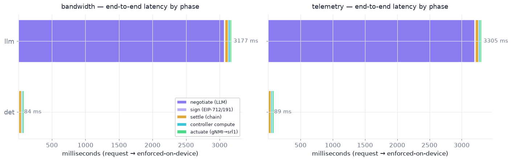
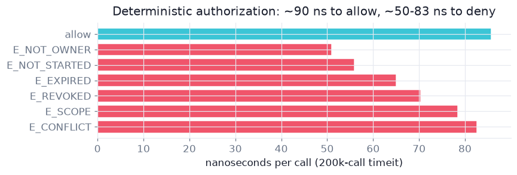
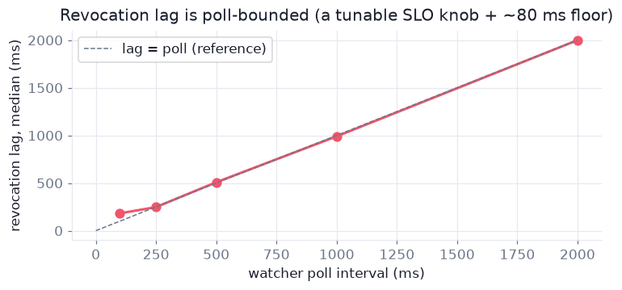
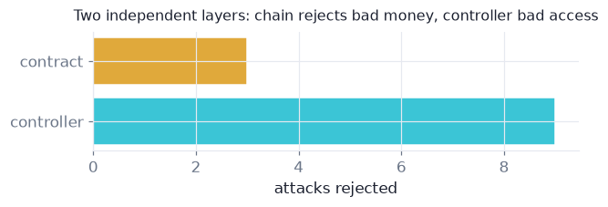
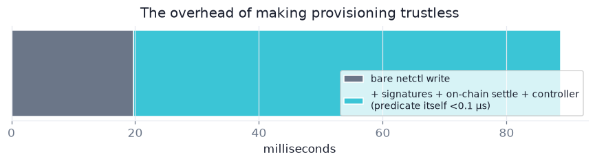

# Evidence — M7.1: the evaluation (harness, campaign, report)

- **Date:** 2026-07-07
- **Commit(s):** branch `m7.1-evaluation`
- **Deliverables:** `e2e/src/e2e/experiments.py` (harness, 7 experiments) ·
  `e2e/runs/eval/*.jsonl` + `summary.json` (the dataset, committed as evidence) ·
  [`docs/09-evaluation.md`](../09-evaluation.md) (the report) ·
  `e2e/notebooks/evaluation_explore.ipynb` (figures; runs green headless) ·
  `contracts/.gas-snapshot` (independent gas cross-check) · `just eval`.

## What ran (all against the real stack: Anvil + controller + gNMI→SR Linux + Modal Qwen3-4B)

```
== latency ==  n=20 per mode×service → 80/80 lifecycles ok, 0 failures
  det  e2e median  89 ms [68–129]   llm e2e median 3.27 s [3.10–3.62]
== predicate ==  allow 86 ns · denials 51–83 ns  (200k-call timeit per outcome)
== expiry ==  tick→deconfig median 73 ms [65–85]  (n=10)
== revlag sweep ==  poll 0.1/0.25/0.5/1.0/2.0 s → lag 182/248/508/990/1999 ms
== baseline ==  bare netctl apply median 20 ms → trustlessness ≈ +69 ms
== adversarial ==  12/12 rejected at the predicted layer (3 contract, 9 controller);
                   1 case allowed by design (2nd ticket/resource → provider ledger)
== gas ==  fulfill 268k (bandwidth) / 447k (telemetry) · revoke 30k · approve 46k
           forge snapshot cross-check: fulfill 324–347k (different fixtures/warmth)
== llm ==  quote 10/10 valid+in-band (all anchored at 10 TOK — no price discovery);
           decide 12/12 correct vs ground truth; ~1114 tokens (<1¢)/negotiation
```

## Figures (rendered by `evaluation_explore.ipynb` from `e2e/runs/eval/`)

**E1 — where the time goes.** The purple bar *is* the finding: ~96 % of the llm-mode
lifecycle is the two LLM judgment calls; the entire deterministic machinery is the
84–89 ms sliver of the det row.



**E7 — the authorization predicate, isolated.** The full allow path costs 86 ns; every
denial exits earlier and cheaper — the bar order mirrors the predicate's documented
check order. The sharpest number in the evaluation.



**E9 — revocation lag is poll-bounded.** Measured lag hugs the `lag = poll` reference
line and flattens to a ~80 ms actuation floor: a tunable SLO knob, not an architectural
cost.



**E4 — defense in depth.** 12/12 attacks rejected: 3 at the contract (bad *money*),
9 at the controller (bad *access*) — each at its predicted layer.



**E6 — the price of trustlessness.** A bare gNMI write is 20 ms; signatures + on-chain
settle + controller add ~69 ms (the predicate itself <0.1 µs).



## The part that made this slice honest

The first summary was **adversarially audited by a 4-agent panel** before the report was
written. It found, and we fixed: a p95 that was literally the sample max
(`int(0.95·20)=19`); an expiry lag inflated by one full gNMI readback; a pooled fulfill-gas
median (383k) that described **no real transaction** (bimodal 268k/447k by service type);
a revocation clock anchored after an extra receipt RPC; and four claim-level overclaims
("no attack reached the router", "479 ms revocation", "+69 ms = predicate", "prices vary").
docs/09 §2 and §11 carry the corrected definitions and threats-to-validity.

## Explain-back (for the human — answer before the defense)

1. Why is the *predicate microbenchmark* (86 ns) a stronger claim than "activate takes
   38 ms", and what exactly does the 38 ms bundle that the 86 ns excludes?
2. The revocation-lag sweep shows lag ≈ poll + ~80 ms. Which of the two terms is an
   architectural property, and what would change on a public chain?
3. Why must fulfill gas be reported per service type — what makes telemetry's tx 447k vs
   bandwidth's 268k?
4. The second-ticket-on-same-resource attack is *allowed*. Where in the system is
   overselling actually prevented, and why is that the right layer?

## Surprises

- The LLM quote slot anchored to the stated list price across a 50× capacity range —
  perfect schema compliance, zero price discovery. Reported as a finding, not hidden.
- det-mode e2e variance was tiny ([68–129] ms over 40 runs) — the mechanical pipeline is
  boringly stable, which is exactly the property the thesis wants.
